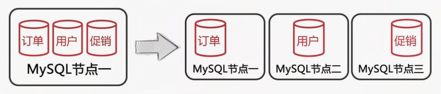

## 分库分表的几种方式

### 把一个实例中的多个数据库拆分到不同的实例

### 把一个库中的表分离到不同的数据库中

## 数据库分片前准备

对一个库中的相关表进行水平拆分到不同实例的数据库中

### 如何选择`分区键`

- 分区键要能尽量避免`跨分片查询`的发生
- 分区键要能尽量使各个分片中的`数据平均`

### 如何存储无需分片的表

- 每个分片中存储一份相同的数据
- 使用额外的节点统一存储

### 如何在节点(node)上部署分片

- 每个分片使用单一数据库，并且数据库名也相同
- 将多个分片表存储在一个数据库中，并在表名上加入分片号后缀
- 在个节点中部署多个数据库，每个数据库包含一个分片

### 如何分配分片中的数据

- 按分区键的Hash值取模来分配分片数据【比较平均】
- 按分区键的范围来分配分片数据【数值、日期】
- 利用`分区键和分片的映射表`来分配分片数据

### 如何生成全局唯一ID

- 使用auto_ increment_increment和auto_increment_offset参数

- 使用全局节点来生成ID
- 在Redis等缓存服务器中创建全局ID