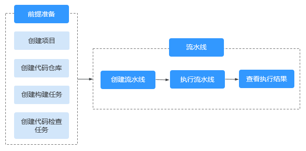
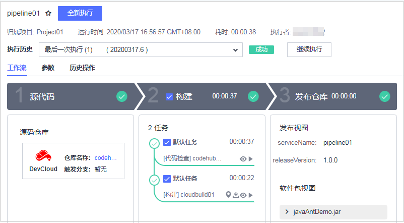

## 简介

流水线（CloudPipeline）提供可视化、可定制的自动交付流水线，帮助企业缩短交付周期，提升交付效率。

流水线无需付费即可使用，需配合DevCloud其他服务使用

流水线服务具有以下特性：

+ 支持编译构建、代码检查、子流水线、部署、流水线控制、扩展类型、接口测试、发布等多种任务类型。
+ 流水线阶段中的任务支持串行执行与并行执行。
+ 执行状态、执行日志上报。
+ 软件包下载。
+ 单任务执行。
+ 进度统计。
+ 流水线参数化执行。
+ 提供流水线执行历史记录。
+ 子任务查看功能。
+ 流水线统计功能。
+ 支持定时执行。
+ 支持根据需要定制流水线阶段。
+ 安全可靠，资源隔离，网络隔离和安全组规则保护，远离病毒、木马骚扰，防DDoS攻击。
+ 服务器统一维护。
+ 支持根据业务需求进行弹性伸缩，可以根据业务需求自行定义弹性配置和策略。

### 功能列表

流水线服务主要功能特性如下：

| 特性                  | 描述                                                         |
| --------------------- | ------------------------------------------------------------ |
| 流水线自定制          | 可根据用户项目需要，自定义流水线的阶段和任务。               |
| 流水线支持任务类型    | 支持编译构建、代码检查、子流水线、部署、流水线控制、扩展类型、接口测试、发布等多种任务类型。 |
| 流水线定时自动执行    | 系统根据用户指定的时间，自动执行用户定义的流水线任务。       |
| 流水线任务构建包下载  | 用户可以选择相应任务的编译构建包下载使用。                   |
| 流水线执行进度统计    | 统计流水线执行进度，方便用户查看执行进展。                   |
| 流水线状态展示        | 展示整个流水线的状态，及其中任务的状态，并可查看日志和报告。 |
| 流水线执行历史        | 系统记录最近5次流水线的执行情况，供用户查看。                |
| 流水线消息通知        | 用户可根据需要设置事件类型的通知状态，包括是否发送服务动态和邮件通知。 |
| 流水线统计功能        | 对流水线的总数、成功率等进行统计，方便用户把握代码质量。     |
| 流水线单任务执行      | 根据用户需求，可选择流水线中的某一个或多个任务单独执行。     |
| 流水线任务构建日志    | 提供任务构建日志，便于用户查看构建的详细情况，进行问题定位及相应处理。 |
| 参数化执行流水线任务  | 流水线定义支持参数，在执行时由用户指定参数值，任务用指定值替换相应参数执行。 |
| 流水线任务串/并行执行 | 根据用户需求，可配置同一阶段内的任务串行执行或并行执行。     |
| 流水线子任务查看功能  | 可查看子任务的配置、执行详情。                               |

### 应用场景

+ 场景特点：软件开发中需要进行代码检查、编译打包、部署、发布等多项活动，管理多个单独的活动比较复杂，增加管理成本。
+ 使用方式：利用流水线技术将开发过程中的多个活动按需进行关联管理，或并行或串行，按需进行执行，提升交付效率。

通过创建一条简单的流水线，介绍配置流水线的前置准备工作及基本操作流程，帮助用户快速建立对流水线的整体印象。例如一家新公司，进行常规操作设置后，能够将流水线用起来。

### 前置准备

#### 新建项目

1. 登录DevCloud首页，单击“新建项目”。
2. 选择Scrum项目类型，输入项目名称（如：Project01）和项目描述，单击“确定”，完成项目的创建。

更详细操作指导请参见[新建Scrum项目](https://support.huaweicloud.com/usermanual-projectman/devcloud_hlp_00032.html)。

#### 新建代码仓库

1. 单击已创建的项目名称进入项目，在顶部导航栏单击“代码 > 代码托管”，进入代码托管页面。
2. 单击右上角“普通新建 > 按模板新建”，选择“Java Maven Demo”模板。
3. 单击“下一步”，填写仓库名称（如：codehub01）等基本信息，单击“确定”，完成代码仓库的创建。

更详细操作指导请参见[新建代码仓库](https://support.huaweicloud.com/usermanual-codehub/devcloud_hlp_00035.html)。

#### 新建构建任务

1. 进入已创建的项目，在顶部导航栏单击“构建&发布 > 编译构建”，进入编译构建页面。

2. 单击右上角

   “新建任务”

   ，根据界面提示完成以下操作：

   1. 填写基本信息：填写任务名称（如：cloudbuild01），选择构建环境主机类型。
   2. 选择代码源：选择已经创建的代码仓库，选择默认分支master。
   3. 选择构建模板：选择Maven系统模板，进入“构建步骤”页面，使用默认配置即可。

更详细操作指导请参见[新建编译构建任务](https://support.huaweicloud.com/usermanual-codeci/devcloud_hlp_00036.html)。

#### 新建代码检查任务

1. 进入已创建的项目，在顶部导航栏单击“代码 > 代码检查”，进入代码检查页面。

2. 单击右上角

   “新建任务”

   ，根据界面提示完成以下操作：

   1. 选择代码源：选择已经创建的代码仓库。
   2. 配置分析参数：填写任务名称（codecheck01），选择Java检查语言。

更详细操作指导请参见[新建代码检查任务](https://support.huaweicloud.com/usermanual-codecheck/devcloud_hlp_00095.html)。

### 快速上手流水线

1. 进入已创建的项目，在顶部导航栏单击“构建&发布 > 流水线”，进入流水线。

2. 单击右上角“新建流水线”，进入**“创建流水线”**页面。

   

   根据界面提示填写基本信息、选择模板、选择代码源，然后单击“下一步”。

   

    

   

3. 进入工作流配置页面，在构建阶段添加已创建的代码检查任务（**codecheck01**）。

   

   

    

   然后添加已创建的构建任务（**cloudbuild01**），方法同上。

   

4. 单击质量门禁下添加质量门禁，选择**“门禁任务”**类型，然后单击“点击创建”。

   

   

    

   

5. 填写门禁名称（如：**test01**），并将代码检查任务对应的门禁项**“CodeCheck问题数”**开关打开，保存并选择已创建的门禁。

   

   

    

   

6. 任务配置完成后单击“保存”，进入流水线详情页面，单击“全新执行”，一键执行流水线。

7. 执行完成后，查看执行结果。

   

   单击构建任务旁的，可以下载通过流水线自动构建出来的构建包。

   