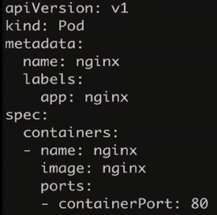

## k8s架构理解

### Docker Swarm Mode Architecture


### Kubernetes Architecture


## minikube快速搭建k8s单节点

### k8s集群构成


> Master的主要职责在于管理集群，协调集群上的所有活动，比如：

- 编排应用
- 维护应用状态
- 扩展应用
- 更新应用等

#### Node

> Node就是一台在kubernetes集群中担任worker的VM或者物理机。在每个Node上都有一个kubelet，而Kubelet就是一个用于管理node和Master之间的沟通的agent。在node上需要安装docker，或者说用于管理容器操作的工具，因为kubernetes并不绑定docker，我们以前介绍过的rkt在kubernetes中也是支持的。而且明眼人都能看出来，rkt纯粹是google用于制衡docker的，rkt和kubernetes深度融合，但是是否能得到市场的认可这并不是一个纯粹技术的问题。
>
> 一个在生产环境中能够大体使用的kubernetes集群至少要有3个node。本来就是node的协调和编排，你就一个node，也非要用kubernetes，虽然可以任性，但是屠龙宝刀只用来裁墙纸多少会有大材小用的唏嘘。

#### Master

> Master则用来管理集群。当你在kubernetes集群上部署应用的时候，你可能会需要Master启动某个应用容器。 Master在集群中协调用于启动此容器的node，而node使用kubernetes API和master进行通信（当然，用户也可以直接使用kubernetes API和集群进行交互）。


### pod最小单位


### Node节点

service


### k8s使用Label select标识pod划分为一个组


## 使用kubectl

|       命令       |                          说明                           |
| :--------------: | :-----------------------------------------------------: |
|   kubectl get    |          诸如kubectl get nodes等等列出资源一览          |
| kubectl describe | 对kubectl取到的信息进一步对某一resource进行更深入的确认 |
|   kubectl logs   |             确认pod的某个container的log信息             |
|   kubectl exec   |   类似于docker exec，可以在某个container中执行命令等    |

```shell
$ cd labs/pod-basic
$ pcat pod_nginx.yml
```



```shell
$ kubectl create -f 
$ kubectl version


$ kubectl create -f pod_nginx.yml
$ kubectl delete -f pod_nginx.yml #删除

$ kubectl get pods
$ kubectl get pods -o wide #详细信息

```


```shell
$ minikube ssh #进入虚拟机

#查看网络
$ docker network ls 
$ docker network inspect bridge# 查看bridge
```

