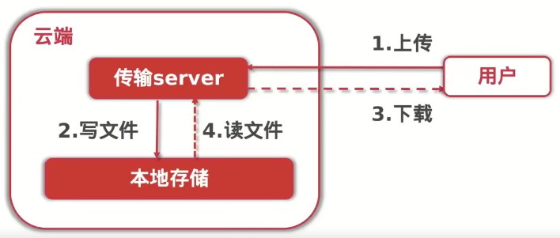
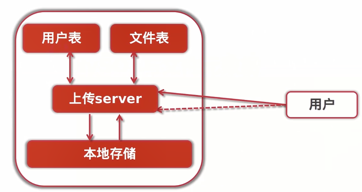
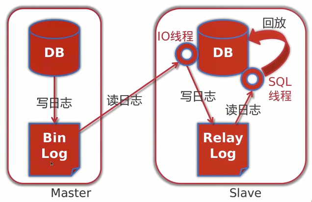

# go实现云存储系统

## 基础架构


### 技术点

- 基于Golang实现分布式文件上传服务

- 重点结合开源存储(Ceph)及公有云(阿里OSS),支持断点续传及秒传功能
- 微服务化及容器化部署

### 工具技术

- Redis / RabbitMQ
- Docker / Kubernets
- 分布式对象存储Ceph
- 阿里云OSS对象存储服务

### 干货

- 文件分块断点上传&秒传
- 对象从Ceph迁移到阿里云OSS的经验

## 文件上传服务

### 服务架构



### 接口列表

|       接口描述       | 接口URL            |
| :------------------: | ------------------ |
|     文件上传接口     | POST /file/upload  |
|     文件查询接口     | GET /file/query    |
|     文件下载接口     | GET /file/download |
|     文件删除接口     | POST /file/delete  |
| 文件修改(重命名)接口 | POST /file/update  |

### go-开启服务端口并处理请求

`/main.go`

```go
package main

import (
   "net/http"
   "./handler"
   "fmt"
)

func main(){
    //相当于路由
   http.HandleFunc("/file/upload", handler.UploadHandler)
    //监听错误信息
   err := http.ListenAndServe(":8081",nil)
   if err !=nil {//处理错误信息
      fmt.Printf("Failed to start server,err:%s",err.Error())
   }
}
```

`/handler/handler.go`

```go
package handler

import (
   "fmt"
   "net/http"
   "io/ioutil"
   "io"
)

func UploadHandler(w http.ResponseWriter, r *http.Request){
   if r.Method == "GET" {
      //返回上传html页面
      data, err := ioutil.ReadFile("./static/view/index.html")
      if err != nil {//处理错误信息
         io.WriteString(w, "internel server error\n")
         fmt.Printf("Failed to start server,err:%s \n",err.Error())
         return
      }
      io.WriteString(w, string(data))
   }else if r.Method == "POST" {
      //接收文件流及存储到本地目录
   }
}
```

### post文件上传接口

```go
http.HandleFunc("/file/upload", handler.UploadHandler)
```

接收文件流及存储到本地目录

```go
package handler

import (
   "fmt"
   "net/http"
   "io/ioutil"
   "io"
   "os"
)

func UploadHandler(w http.ResponseWriter, r *http.Request){
   if r.Method == "GET" {
      //返回上传html页面
      data, err := ioutil.ReadFile("./static/view/index.html")
      if err != nil {
         io.WriteString(w, "internel server error\n")
         fmt.Printf("Failed to start server,err:%s \n",err.Error())
         return
      }
      io.WriteString(w, string(data))
   }else if r.Method == "POST" {
      //接收文件流及存储到本地目录
      file,head,err := r.FormFile("file")
      if err!=nil {
         fmt.Printf("Failed to get data,err:%s \n",err.Error())
         return
      }
      defer file.Close()//关闭文件

      //文件流
      newFile,err := os.Create("./tmp/"+head.Filename)
      if err!=nil {
         fmt.Printf("Failed to create file,err:%s \n",err.Error())
         return
      }
      defer newFile.Close()

      //拷贝到新文件的buffer区
      _,err = io.Copy(newFile,file)
      if err!=nil {
         fmt.Printf("Failed to save data into file,err:%s \n")
         return
      }
      //流程走完成功上传 重定向
      http.Redirect(w,r,"/file/upload/suc",http.StatusFound)
   }
}

//处理文件上传成功信息
func UploadSucHandler(w http.ResponseWriter, r *http.Request){
   io.WriteString(w, "Upload success!")
}
```

### 保存文件元信息

> 1. 获取上传页面
> 2. 选取本地文件， form形式上传文件
> 3. 云端接收文件流，写入本地存储
> 4. 云端更新文件元信息集合

```go
package meta

//FileMeta:文件元信息结构
type FileMeta struct {
   FileSha1 string
   FileName string
   FileSize int64
   Location string
   UploadAt string
}

var fileMetas map[string]FileMeta

func init(){
   //map初始化
   fileMetas = make(map[string]FileMeta)
}

//UpdateFileMeta: 新增、更新文件元信息
func UpdateFileMeta(fmeta FileMeta){
   fileMetas[fmeta.FileSha1]=fmeta
}
// GetFileMeta: 通过SHA1 获取文件信息对象
func GetFileMeta(fileSha1 string) FileMeta{
   return fileMetas[fileSha1]
}
```

### 单个文件查询元信息接口

```go
http.HandleFunc("/file/meta",handler.GetFileMetaHandler)
```

`/handler/handler.go`

```go
// 获取文件元信息
func GetFileMetaHandler(w http.ResponseWriter,r *http.Request){
    r.ParseForm()

    filehash := r.Form["filehash"][0]
    fMeta := meta.GetFileMeta(filehash)
    data, err := json.Marshal(fMeta) // 转换成json格式
    if err!=nil {
        fmt.Printf("failed to get file meta,err:%s \n",err.Error())
    }
    w.Write(data)

}
```

### 文件下载接口

```go
http.HandleFunc("/file/download",handler.DownloadHandler)
```

`/handler/handler.go`

```go
func DownloadHandler(w http.ResponseWriter,r *http.Request){
	r.ParseForm()
	fsha1 := r.Form.Get("filehash")
	fm := meta.GetFileMeta(fsha1)

	f,err := os.Open(fm.Location)
	if err != nil {
		w.WriteHeader(http.StatusInternalServerError)
		return
	}
	defer f.Close()

	data,err := ioutil.ReadAll(f)
	if err!= nil {
		w.WriteHeader(http.StatusInternalServerError)
		return
	}

	w.Header().Set("Content-Type", "application/octect-stream")
	// attachment表示文件将会提示下载到本地，而不是直接在浏览器中打开
	w.Header().Set("content-disposition", "attachment; filename=\""+fm.FileName+"\"")
	w.Write(data)

}
```

### 文件Meta更新(重命名)接口

`/handler/handler.go`

```go
// 删除文件及元信息
func FileDeleteHandler(w http.ResponseWriter, r *http.Request) {
   r.ParseForm()
   fileSha1 := r.Form.Get("filehash")

   fMeta := meta.GetFileMeta(fileSha1)
   // 删除文件 物理删除
   os.Remove(fMeta.Location)
   // 删除文件元信息
   meta.RemoveFileMeta(fileSha1)
   // TODO: 删除表文件信息

   w.WriteHeader(http.StatusOK)
}
```

`/meta/filemeta`

```go
// RemoveFileMeta : 删除元信息
func RemoveFileMeta(fileSha1 string) {
	delete(fileMetas, fileSha1)
}
```


### 文件删除接口

## MYSQL服务架构变迁

### 架构变迁



### 安装模式

- 单点模式

- 主从模式

  