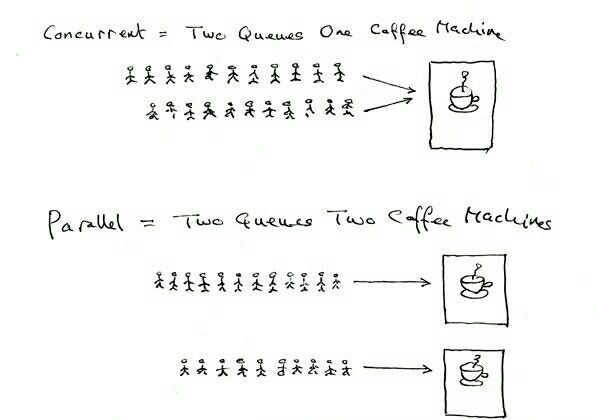

## 并发与并行

> 你很可能从某种途径听说过 Go 语言。它越来越受欢迎，并且有充分的理由可以证明。 Go 快速、简单，有强大的社区支持。学习这门语言最令人兴奋的一点是它的并发模型。 Go 的并发原语使创建多线程并发程序变得简单而有趣。我们将通过本实验介绍，希望能点透相关概念以方便后续学习。

#### 并发与并行

并发指在同一时刻只能有一条指令执行，但多个进程指令被快速的轮换执行，使得在宏观上具有多个进程同时执行的效果，但在微观上并不是同时执行的，只是把时间分成若干段，通过 CPU 时间片轮转使多个进程快速交替的执行。而并行的关键是你有同时处理多个任务的能力。并发和并行都可以是很多个线程，就看这些线程能不能同时被（多个）CPU 执行，如果可以就说明是并行，而并发是多个线程被（一个）CPU 轮流切换着执行。

一个经典且通俗易懂的例子这样解释并发与并行的区别：

- 并发是两个队列，使用一台咖啡机；

- 并行是两个队列，使用两台咖啡机。

如果串行，一个队列使用一台咖啡机，那么哪怕前面那个人有事出去了半天，后面的人也只能等着他回来才能去接咖啡，这效率无疑是最低的。图解：

#### 协程

协程也叫轻量级线程。与传统的进程和线程相比，协程最大的优点就在于其足够“轻”，操作系统可以轻松创建上百万个协程而不会导致系统资源枯竭，而线程和进程通常最多不过近万个。而多数语言在语法层面上是不支持协程的，一般都是通过库的方式进行支持，但库的支持方式和功能不够完善，经常会引发阻塞等一系列问题，而 Go 语言在语法层面上支持协程，也叫 `goroutine`。这让协程变得非常简单，让轻量级线程的切换管理不再依赖于系统的进程和线程，也不依赖 CPU 的数量。