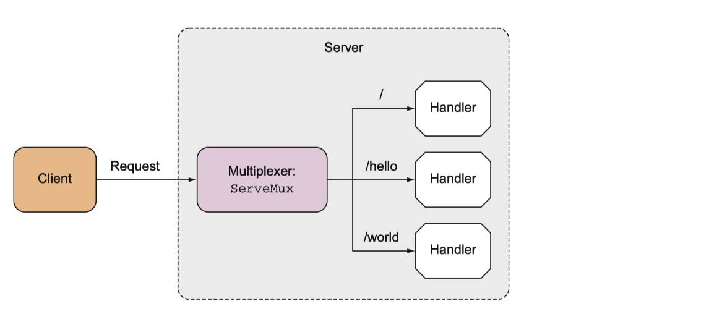

### HTTP 服务器实现

首先，我们基于 [HTTP 编程](https://xueyuanjun.com/post/21040)中介绍的 [net/http](https://golang.google.cn/pkg/net/http/) 包来实现一个简单的 HTTP 服务器作为 Web 服务器：

```go
package main

import (
    "fmt"
    "log"
    "net/http"
    "strings"
)

func sayHelloWorld(w http.ResponseWriter, r *http.Request)  {
    r.ParseForm() // 解析参数
    fmt.Println(r.Form) // 在服务端打印请求参数
    fmt.Println("URL:", r.URL.Path)  // 请求 URL
    fmt.Println("Scheme:", r.URL.Scheme)
    for k, v := range r.Form {
        fmt.Println(k, ":", strings.Join(v, ""))
    }
    fmt.Fprintf(w, "你好，学院君！")  // 发送响应到客户端
}

func main()  {
    http.HandleFunc("/", sayHelloWorld)
    err := http.ListenAndServe(":9091", nil)
    if err != nil {
        log.Fatal("ListenAndServe: ", err)
    }
}
```

在这段代码中，我们在入口函数中通过 `http.HandleFunc()` 方法定义了一个路由 `/` 和对应的路由处理函数 `sayHelloWorld`（在该函数中，`r` 代表请求对象，`w` 代表响应对象），然后通过 `http.ListenAndServe` 启动这个 HTTP 服务器，并设置监听端口为 `9091`。

#### Laravel 中的对比实现

如果与 PHP 应用类比的话，以 Laravel 框架为例，上述路由定义操作类似我们在 `routes/web.php` 定义一个这样一个首页路由：

```go
Route::get('/', function(Request $request) {
    dump($request->all());  // 打印请求数据
    dump("URL:" .  $request->path());  // 请求路径
    dump("Scheme:", $request->getScheme()); // 获取 Scheme
    foreach ($request->all() as $key => $value) {
        dump($key . ":" . $value);
    }
    return "你好，学院君！";  // 发送响应到客户端
});
```

然后启动 PHP 内置 Web 服务器监听客户端请求，默认监听的是 `8000` 端口（PHP 中这块逻辑底层帮我们封装好了，开发者只需要关心上层业务逻辑代码即可）：

`php artisan serve`

### 客户端请求测试

接下来，我们对 Go 语言实现的简易 Web 应用进行测试，要启动 Golang 的 HTTP 服务器，需要在对应代码所在目录运行如下代码：

```shell
$ go run server.go
```

然后在浏览器中请求 `http://localhost:9091`

服务端也会输出对应的请求日志：

```
map[age:[23] name:[kiyo] skill:[go]]
URL: /
Scheme: 
skill : go
name : kiyo
age : 23
map[]
URL: /favicon.ico
Scheme: 
```

#### Laravel 中的对比测试

如果要在基于 PHP Laravel 框架编写的测试应用中体验类似输出，需要先安装如下扩展包使得 `dump` 函数打印信息出现在服务端日志而不是渲染到客户端浏览器：

```
composer require --dev beyondcode/laravel-dump-server
```

然后再另外打开一个窗口执行如下命令用于打印服务端 `dump` 函数输出：

# 路由分发

## Go 语言 HTTP 请求处理的底层机制

### 工作流程

客户端发起的 HTTP 请求是通过 Go 语言实现的 HTTP 服务器监听、接收、处理并返回响应的，这个 HTTP 服务器底层工作流程如下：

1. 创建 Listen Socket，监听指定的端口，等待客户端请求到来；
2. Listen Socket 接收客户端的请求，得到 Client Socket，接下来通过 Client Socket 与客户端通信；
3. 处理客户端的请求，首先从 Client Socket 读取 HTTP 请求的协议头, 如果是 POST 方法, 还可能要读取客户端提交的数据，然后交给相应的 Handler（处理器）处理请求，Handler 处理完毕后装载好客户端需要的数据，最后通过 Client Socket 返回给客户端。

上述流程对应的是上一篇 `server.go` 源码中的如下这两行代码：

```go
http.HandleFunc("/", sayHelloWorld)
err := http.ListenAndServe(":9091", nil)
```

如果与基于 Nginx + PHP-FPM 驱动的 PHP Web 应用类比，这里的 HTTP 服务器对应 PHP-FPM。

### 更进一步

有关处理器绑定的路由与对应方法的实现细节，我们后面介绍路由、请求、表单、响应、视图等实现时会详细介绍，这里我们先将注意力放到 `http.ListenAndServe` 这行代码，看看底层到底做了些什么。

关于这个方法的使用我们在 [HTTP 编程之 HTTP/HTTPS 请求处理](https://xueyuanjun.com/post/21040)这篇教程中已经简单介绍过，这里，我们更深入系统的研究下底层的处理逻辑。

#### 创建 Listen Socket 监听端口

该方法底层调用的是 `net/http` 包的 `ListenAndServe` 方法，首先会初始化一个 `Server` 对象，然后调用该 `Server` 实例的 `ListenAndServe` 方法，进而调用 `net.Listen("tcp", addr)`，也就是基于 TCP 协议创建 Listen Socket，并在传入的IP 地址和端口号上监听请求，在本例中，IP 地址为空，默认是本机地址，端口号是 `9091`：

```go
func (srv *Server) ListenAndServe() error {
   if srv.shuttingDown() {
      return ErrServerClosed
   }
   addr := srv.Addr
   if addr == "" {
      addr = ":http"
   }
   ln, err := net.Listen("tcp", addr) //基于TCP协议创建 Listen Socket
   if err != nil {
      return err
   }
   return srv.Serve(ln)
}
```

#### 接收客户端请求并建立连接

创建 Listen Socket 成功后，调用 `Server` 实例的 `Serve(net.Listener)` 方法，用来接收并处理客户端的请求信息。

这个方法里面起了一个 `for` 循环，在循环体中首先通过 `net.Listener`（即上一步监听端口中创建的 Listen Socket）实例的 `Accept` 方法接收客户端请求，接收到请求后根据请求信息创建一个 `conn` 连接实例，最后单独开了一个 goroutine，把这个请求的数据当做参数扔给这个 `conn` 去服务：

```go
func (srv *Server) Serve(l net.Listener) error {
   if fn := testHookServerServe; fn != nil {
      fn(srv, l) // call hook with unwrapped listener
   }

   origListener := l
   l = &onceCloseListener{Listener: l}
   defer l.Close()

   if err := srv.setupHTTP2_Serve(); err != nil {
      return err
   }

   if !srv.trackListener(&l, true) {
      return ErrServerClosed
   }
   defer srv.trackListener(&l, false)

   baseCtx := context.Background()
   if srv.BaseContext != nil {
      baseCtx = srv.BaseContext(origListener)
      if baseCtx == nil {
         panic("BaseContext returned a nil context")
      }
   }

   var tempDelay time.Duration // how long to sleep on accept failure

   ctx := context.WithValue(baseCtx, ServerContextKey, srv)
   for {
      rw, err := l.Accept()
      if err != nil {
         select {
         case <-srv.getDoneChan():
            return ErrServerClosed
         default:
         }
         if ne, ok := err.(net.Error); ok && ne.Temporary() {
            if tempDelay == 0 {
               tempDelay = 5 * time.Millisecond
            } else {
               tempDelay *= 2
            }
            if max := 1 * time.Second; tempDelay > max {
               tempDelay = max
            }
            srv.logf("http: Accept error: %v; retrying in %v", err, tempDelay)
            time.Sleep(tempDelay)
            continue
         }
         return err
      }
      connCtx := ctx
      if cc := srv.ConnContext; cc != nil {
         connCtx = cc(connCtx, rw)
         if connCtx == nil {
            panic("ConnContext returned nil")
         }
      }
      tempDelay = 0
      c := srv.newConn(rw)
      c.setState(c.rwc, StateNew) // before Serve can return
      go c.serve(connCtx)
   }
}
```

这个就是高并发体现了，用户的每一次请求都是在一个新的 goroutine 去服务，相互不影响。客户端请求的具体处理逻辑都是在 `c.serve` 中完成的。

#### 处理客户端请求并返回响应

接下来，我们进入 `conn` 实例的 `serve` 方法源码，看看底层如何将 HTTP 请求分配给指定处理器方法进行处理。

`conn` 首先会通过 `c.readRequest()` 解析请求，然后在 `serverHandler{c.server}.ServeHTTP(w, w.req)` 的 `ServeHTTP` 方法中获取相应的 `handler`：`handler := c.server.Handler`，也就是我们刚才在调用函数 `ListenAndServe` 时候的第二个参数。

我们在上篇教程的示例中传递的是 `nil`，则默认会获取 `DefaultServeMux`, 这个 `handler` 变量其实就是一个路由器，它用来匹配 URL 路由与对应的处理函数，而这个映射关系在 `main` 函数的第一行代码中就完成了：`http.HandleFunc("/", sayHelloWorld)`，其作用就是注册了请求 `/` 的路由规则，当请求 URL 路由为 `/`，就会跳转到函数 `sayhelloWorld` 来处理请求，`DefaultServeMux` 会调用 `ServeHTTP` 方法，这个方法内部其实就是调用 `sayhelloWorld` 方法本身（在 Go 语言中函数本身是第一类公民，可以当作实现了 `Handler` 接口的类型，只不过对应的的 ServeHTTP 方法内部调用的是函数自身而已），最后通过写入 `ResponseWriter` 对象将响应返回到客户端：

```go
func (sh serverHandler) ServeHTTP(rw ResponseWriter, req *Request) {
   handler := sh.srv.Handler
   if handler == nil {
      handler = DefaultServeMux
   }
   if req.RequestURI == "*" && req.Method == "OPTIONS" {
      handler = globalOptionsHandler{}
   }
   handler.ServeHTTP(rw, req)
}
```

当然，对于复杂的逻辑，我们也可以自己实现 `Handler` 接口并将对象实例作为 `http.ListenAndServe` 的第二个参数传入。

这里的逻辑可以类比为 Laravel 框架中的路由定义来学习，对于默认的 `DefaultServeMux` 实现，可以理解为基于匿名函数实现的路由规则定义，对于自定义 `Handler` 接口实现的处理器，可以理解为基于控制器实现的路由规则定义。

## Go 语言路由映射和请求分发的底层实现及自定义路由器

### 引子

从这一篇教程起，我们将从自定义路由开始探索 Go Web 编程之旅。

开始之前，我们还是回顾下[创建第一个 Web 应用](https://xueyuanjun.com/post/21298)中的示例代码：

```go
http.HandleFunc("/", sayHelloWorld)
err := http.ListenAndServe(":9091", nil)
```

我们在[上篇教程](https://xueyuanjun.com/post/21316)介绍过这段代码的底层实现，这里 `http.ListenAndServe` 方法第二个参数传入的是 `nil`，表示底层会使用默认的 `DefaultServeMux` 实现将上述 `HandleFunc` 方法传入的处理函数转化为类似 Laravel 框架中基于闭包方式定义的路由：

```go
func (sh serverHandler) ServeHTTP(rw ResponseWriter, req *Request) {
   handler := sh.srv.Handler
   if handler == nil {
      handler = DefaultServeMux
   }
   if req.RequestURI == "*" && req.Method == "OPTIONS" {
      handler = globalOptionsHandler{}
   }
   handler.ServeHTTP(rw, req)
}
```

如上篇教程所言，如果我们想要实现自定义的路由处理器，则需要构建一个自定义的、实现了 `Handler` 接口的类实例作为 `http.ListenAndServe` 的第二个参数传入。

在开始介绍自定义路由处理器实现之前，我们先来看看 `DefaultServeMux` 是如何保存路由映射规则以及分发请求做路由匹配的。

### DefaultServeMux 底层实现

顾名思义，`DefaultServeMux` 是 `ServeMux` 的默认实例：

```go
var DefaultServeMux = &defaultServeMux
var defaultServeMux ServeMux
```

这里的后缀 `Mux` 是 Multiplexer 的缩写，ServeMux 可以看作是 HTTP 请求的多路复用器，如果你对这个名词感到陌生，不妨将其类比为 Laravel 框架中的路由器。它们要实现的功能是一致的：接受 HTTP 请求，然后基于映射规则将其转发给正确的处理器进行处理。

那么在 Go Web 应用中，这些路由映射规则是怎么定义的呢？

#### 路由映射规则保存

首先我们来看一下 `ServeMux` 的数据结构：

```go
type ServeMux struct {
    mu    sync.RWMutex. // 由于请求涉及到并发处理，因此这里需要一个锁机制
    m     map[string]muxEntry // 路由规则字典，存放 URL 路径与处理器的映射关系
    es    []muxEntry // MuxEntry 切片（按照最长到最短排序）
    hosts bool       // 路由规则中是否包含 host 信息
}
```

这里，我们需要重点关注的是 `muxEntry` 结构：

```go
type muxEntry struct {
    h   Handler       // 处理器具体实现
    pattern string    // 模式匹配字符串
}
```

最后我们来看一下 `Handler` 的定义，这是一个接口：

```go
type Handler interface {
    ServeHTTP(ResponseWriter, *Request) // 路由处理实现方法
}
```

当请求路径与 `pattern` 匹配时，就会调用 `Handler` 的 `ServeHTTP` 方法来处理请求。

以我们之前编写的示例应用为例，就是将 URL 路径为 `/` 的请求转发到 `sayHelloWorld` 进行处理：

```go
http.HandleFunc("/", sayHelloWorld)
```

不过 `sayHelloWorld` 只是一个函数，并没有实现 `Handler` 接口，

之所以可以成功添加到路由映射规则，是因为在底层通过 `HandlerFunc()` 函数将其强制转化为了 `HandlerFunc` 类型，而 `HandlerFunc` 类型实现了 `ServeHTTP` 方法，这样，`sayHelloWorld` 方法也就变相实现了 `Handler` 接口：

```go
func (mux *ServeMux) HandleFunc(pattern string, handler func(ResponseWriter, *Request)) {
    if handler == nil {
        panic("http: nil handler")
    }
    mux.Handle(pattern, HandlerFunc(handler))
}

...

type HandlerFunc func(ResponseWriter, *Request)

func (f HandlerFunc) ServeHTTP(w ResponseWriter, r *Request) {
    f(w, r)
}
```

对于 `sayHelloWorld` 方法来说，它已然变成了 `HandlerFunc` 类型的函数类型，当我们在其实例上调用 `ServeHTTP` 方法时，调用的是 `sayHelloWorld` 方法本身。

前面我们提到，`DefaultServeMux` 是 `ServeMux` 的默认实例，当我们在 `HandleFunc` 中调用 `mux.Handle` 方法时，实际上是将其路由映射规则保存到 `DefaultServeMux` 路由处理器的数据结构中：

```go
func (mux *ServeMux) Handle(pattern string, handler Handler) {
	mux.mu.Lock()
	defer mux.mu.Unlock()

	if pattern == "" {
		panic("http: invalid pattern")
	}
	if handler == nil {
		panic("http: nil handler")
	}
	if _, exist := mux.m[pattern]; exist {
		panic("http: multiple registrations for " + pattern)
	}

	if mux.m == nil {
		mux.m = make(map[string]muxEntry)
	}
	e := muxEntry{h: handler, pattern: pattern}
	mux.m[pattern] = e
	if pattern[len(pattern)-1] == '/' {
		mux.es = appendSorted(mux.es, e)
	}

	if pattern[0] != '/' {
		mux.hosts = true
	}
}
```

还是以 `sayHelloWorld` 为例，这里的 `pattern` 字符串对应的是请求路径 `/`，`handler` 对应的是 `sayHelloWorld` 函数。

#### 请求分发与路由匹配

保存好路由映射规则之后，客户端请求又是怎么分发的呢？或者说请求 URL 与 `DefaultServeMux` 中保存的路由映射规则是如何匹配的呢？

我们在上篇教程介绍过，处理客户端请求时，会调用默认 `ServeMux` 实现的 `ServeHTTP` 方法：

```go
func (mux *ServeMux) ServeHTTP(w ResponseWriter, r *Request) {
    if r.RequestURI == "*" {
        w.Header().Set("Connection", "close")
        w.WriteHeader(StatusBadRequest)
        return
    }
    
    h, _ := mux.Handler(r)
    h.ServeHTTP(w, r)
}
```

如上所示，路由处理器接收到请求之后，如果 URL 路径是 `*`，则关闭连接，否则调用 `mux.Handler(r)` 返回对应请求路径匹配的处理器，然后执行 `h.ServeHTTP(w, r)`，也就是调用对应路由 `handler` 的 `ServerHTTP` 方法，以 `/` 路由为例，调用的就是 `sayHelloWorld` 函数本身。

至于 `mux.Handler(r)` 的底层匹配实现，感兴趣的同学可以去 `net/http` 包中查看对应的底层源码，这里就不详细展开了。

通过上面的介绍，我们了解了基于 `DefaultServeMux` 实现的整个路由规则存储（Web 应用启动期间进行）和请求匹配过程（客户端发起请求时进行），下面我们来看一下如何实现自定义的 路由处理器。

### 自定义路由处理器

如果你搞清楚了上面的默认实现，编写自定义的路由处理器就会非常简单，我们只需要定义一个实现了 `Handler` 接口的类，然后将其实例传递给 `http.ListenAndServe` 方法即可：

```go
package main

import (
    "fmt"
    "net/http"
)

type MyHander struct {

}

func (handler *MyHander) ServeHTTP(w http.ResponseWriter, r *http.Request)  {
    if r.URL.Path == "/" {
        sayHelloGolang(w, r)
        return
    }
    http.NotFound(w, r)
    return
}

func sayHelloGolang(w http.ResponseWriter, r *http.Request) {
    fmt.Fprintf(w, "Hello Golang!")
}

func main()  {
    handler := MyHander{}
    http.ListenAndServe(":9091", &handler)
}
```

我们运行 `go run router.go` 来启动这个应用，然后在浏览器中就可以访问 `/` 路由了：


这个实现很简单，而且我们并没有在应用启动期间初始化路由映射规则，而是在应用启动之后根据请求参数动态判断来做分发的，这样做会影响性能，而且非常不灵活，我们可以通过定义多个处理器的方式来解决这个问题：

```go
package main

import (
    "fmt"
    "net/http"
)

type HelloHander struct {

}

func (handler *HelloHander) ServeHTTP(w http.ResponseWriter, r *http.Request)  {
    sayHelloGolang(w, r)
}

type WorldHander struct {

}

func (handler *WorldHander) ServeHTTP(w http.ResponseWriter, r *http.Request)  {
    fmt.Fprintf(w, "Hello World!")
}

func sayHelloGolang(w http.ResponseWriter, r *http.Request) {
    fmt.Fprintf(w, "Hello Golang!")
}

func main()  {
    hello := HelloHander{}
    world := WorldHander{}
    server := http.Server{
        Addr: ":9091",
    }
    http.Handle("/hello", &hello)
    http.Handle("/world", &world)
    server.ListenAndServe()
}
```

只是，我们又回到了老路子上，这里没有显式传入 handler，所以底层依然使用的是 `DefaultServeMux` 那套路由映射与请求分发机制，要实现完全自定义的、功能更加强大的处理器，只能通过自定义 ServeMux 来实现了，不过在这个领域，已经有非常好的第三方轮子可以直接拿来用了，比如 [gorilla/mux](https://github.com/gorilla/mux) 就是其中之一，后续教程我们都将使用它作为路由器，下篇教程我们将简单介绍它的基本使用。