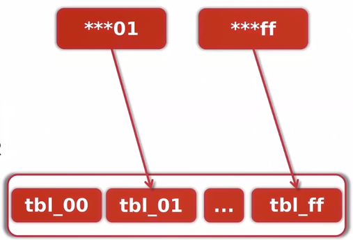

## MYSQL服务架构变迁

### 架构变迁


### 安装模式

- 单点模式

- 主从模式

  >  重放主节点操作

  

### MySQL主从数据同步

```mysql 
show master status

CHANGE MASTER TO MASTER_HOST='192.168.2.244',MASTER_USER='reader',MASTER_PASSWORD='reader',MASTER_LOG_FILE='binlog.000002',MASTER_LOG_POS=0;
#ifconfig 查找主机 ip
```


从数据库

```mysql
start slave
show slave status\G
```

建表

```mysql
create database testl default character set utf8;
show databases;
use test1;
create table tbl_test (
    'user' varchar(64) not null,
    'age' int(11) not null
)default charset utf8;
```

从数据库查询数据

```mysql
select * from tbl_test
```


### 水平分表

假设分成256张文件表，按文件Sha1值后两位来切分则以:` tbl_${file_sha1}[:-2]`的规则到对应表进行存取



### Golang操作MySQL

- 使用Go标准接口

封装mysql连接

```go
package mysql

import (
   "database/sql"
   "fmt"
   "os"


   _"github.com/go-sql-driver/mysql"
)

var db *sql.DB

func init(){
   db,_=sql.Open("mysql","root:root@tcp(127.0.0.1:3307)/fileserver?charset=utf8")
   db.SetMaxOpenConns(1000)
   err:=db.Ping()
   if err!=nil {
      fmt.Printf("Failed to connect to mysql,err"+err.Error())
      os.Exit(1)
   }
}

//外部接口 返回数据库连接对象
func DBConn()*sql.DB{
   return db
}
```