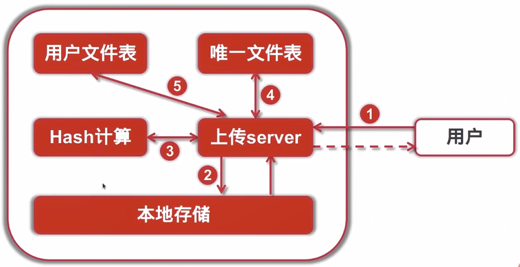

## 文件的校验值计算

| 校验算法类型 | 校验值长度 | 校验值类别        | 安全/纠错 | 计算效率 | 应用场景           |
| :----------- | :--------- | :---------------- | :-------- | :------- | ------------------ |
| CRC(32/64)   | 4、8字节   | 多项式除法 校验码 | 弱        | 高       | 物理层传输         |
| MD5          | 16字节     | 轮转计算HASH      | 中        | 中       | 文件校验、数据签名 |
| SHA1         | 20字节     | 轮转计算HASH      | 高        | 低       | 文件校验、数据签名 |

## 秒传原理

### 场景：

1. 用户上传

2. 离线下载

3. 好友分享

### 关键点：

1. 文件Hash(MD5,SHA1)
2. 用户文件关联

### 服务架构变迁：



### 用户文件表

```mysql
-- 创建用户文件表
CREATE TABLE `tbl_user_file` (
    `id` int(11) NOT NULL PRIMARY KEY AUTO_INCREMENT,
    `user_name` varchar(64) NOT NULL,
    `file_sha1` varchar(64) NOT NULL DEFAULT '' COMMENT '文件hash',
    `file_size` bigint(20) DEFAULT '0' COMMENT '文件大小',
    `file_name` varchar(256) NOT NULL DEFAULT '' COMMENT '文件名',
    `upload_at` datetime DEFAULT CURRENT_TIMESTAMP COMMENT '上传时间',
    `last_update` datetime DEFAULT CURRENT_TIMESTAMP 
    ON UPDATE CURRENT_TIMESTAMP COMMENT '最后修改时间',
    `status` int(11) NOT NULL DEFAULT '0' COMMENT '文件状态(0正常1已删除2禁用)',
    UNIQUE KEY `idx_user_file` (`user_name`, `file_sha1`),
    KEY `idx_status` (`status`),
    KEY `idx_user_id` (`user_name`)
) ENGINE=InnoDB DEFAULT CHARSET=utf8mb4;
```

## 相同文件冲突处理

1. 允许不同用户同时上传同一个文件

2. 先完成上传的先入库

3. 后上传的只更新用户文件表,并删除已上传的文件