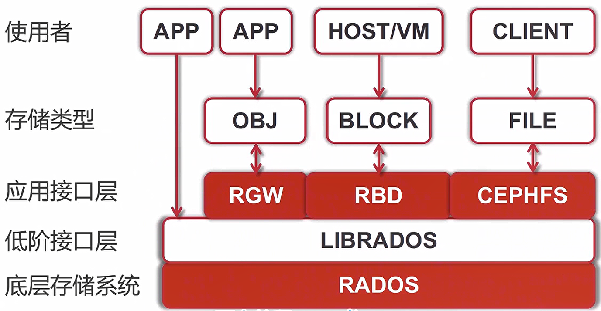
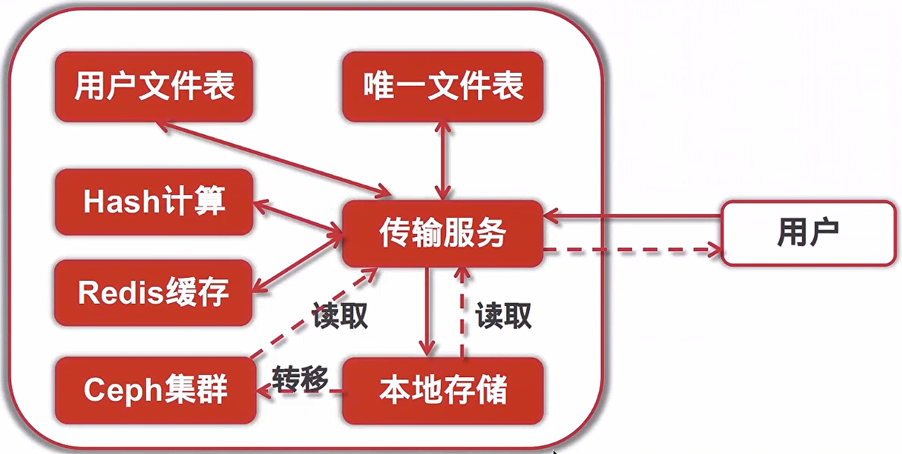

## Ceph体系结构

## Ceph基础组件

| 名称        | 作用                                                       |
| ----------- | ---------------------------------------------------------- |
| OSD         | 用于集群中所有数据与对象的存储:存储/复制/平衡/恢复数据等等 |
| MDS         | 监控集群状态，维护cluster MAP表，保证集群数据一致性        |
| Monitor     | 保存文件系统服务的元数据（OBJ/Block不需要该服务）          |
| GW(gateway) | 提供与Amazon S3和Swift兼容的RESTful的gateway服务API        |

## AWS S3术语

| 名称     | 术语                                                        |
| -------- | ----------------------------------------------------------- |
| Region   | 存储数据所在的地理区域                                      |
| Endpoint | 存储服务入口，Web服务入口点的URL                            |
| Bucket   | 存储桶是S3中用于存储对象的容器                              |
| Object   | 对象是S3中存储的基本实体，由对象数据和元数据组成            |
| Key      | 键是存储桶中对象的唯一标识符，桶内的每个对象都只能有一个key |

## 服务架构变迁

获取key

`docker exec -it gwnode radosgw-admin user create --uid=userl --display-name=user1`