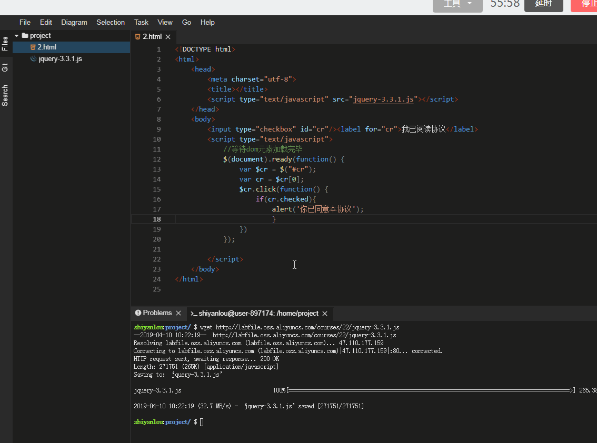
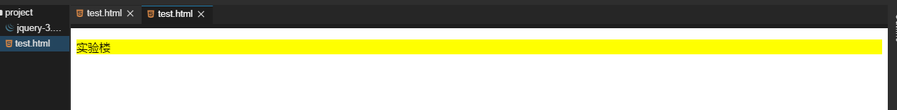

# 介绍

## jQuery简介

### 什么是 jQuery

jQuery 是开源软件，使用 MIT 许可证授权。jQuery 的语法设计使得许多操作变得容易，如`操作文档对象（document）`、`选择文档对象模型（DOM）元素`、创建动画效果、处理事件、以及开发 Ajax 程序。jQuery 也给开发人员提供了在其上创建插件的能力。这使开发人员可以对底层交互与动画、高级效果和高级主题化的组件进行抽象化。模块化的方式使 jQuery 函数库能够创建功能强大的动态网页以及网络应用程序。

微软和诺基亚已宣布在他们的平台上绑定 jQuery。微软最初在 Visual Studio 中集成了 jQuery 以便在微软自己的 ASP.NET AJAX 框架和 ASP.NET MVC Framework 中使用，而诺基亚则在他的 Web 运行时组件开发平台中集成了 jQuery。MediaWiki 自从 1.16 版本后也开始使用 jQuery。

jQuery 1.3 版以后，引入全新的层叠样式表（CSS）选择器引擎 Sizzle。同时不再提供 Packed 版本，因为解压缩所消耗的时间，远大于所节省的下载时间，且不利于调试，且已有 Google AJAX Libraries API 等公开站台提供 jQuery 的 js 的引用服务，故 Packed 版本原本的优点已荡然无存。

注：定义来自维基百科。

我们可以简单的理解为 jQuery 是一个 JavaScript 函数库。jQuery 是一个轻量级的"写的少，做的多"的 JavaScript 库。

### 特色

+ 使用多浏览器开源选择器引擎 Sizzle（jQuery 项目的派生产品）进行 DOM 元素选择
+ 基于 CSS 选择器的 DOM 操作，使用元素的名称和属性（如 id 和 class）作为选择 DOM 中节点的条件
+ 事件
+ 特效和动画
+ Ajax
+ Deferred 和 Promise 对象来控制异步处理
+ JSON 解析
+ 通过插件扩展
+ 工具函数，如特征检测
+ 现代浏览器中本地的兼容性方法，但对于旧版浏览器需要后备（fallback）方法，比如 inArray()和 each()
+ 多浏览器（不要与跨浏览器混淆）支持

## jQuery 语法

jQuery 语法是为 HTML 元素的选取编制的，可以对元素执行某些操作。

基础语法是：

```js
$(selector).action();
```

+ 美元符号` $ `定义 jQuery。
+ 选择符（selector）“查询”和“查找” HTML 元素。
+ jQuery 的 action() 执行对元素的操作。

另外需要注意的是：在 jQuery 库中`$` 符号就是 jQuery 的一个简写形式，例如 `$("#syl")` 和 `jQuery("#syl")` 是等价的，`$.ajax` 和 `jQuery.ajax` 是等价的，如果没有特别说明，程序中的 `$` 符号都是 jQuery 的一个简写形式。

### 1 文档就绪函数

所有 jQuery 函数位于一个 document ready 函数中：

```js
$(document).ready(function(){

});

// 可以简写成

$(funciton(){

});
```

这是为了防止文档在完全加载（就绪）之前运行 jQuery 代码。如果在文档没有完全加载之前就运行函数，操作可能失败。下面是两个具体的例子：

+ 试图隐藏一个不存在的元素。
+ 获得未完全加载的图像的大小。

上面的这段代码其实有点类似于传统 JavaScript 中的 window.onload 方法，不过它们还是有一些区别的，简单对比如下所示：

|          | window.onload                                          | $(doucment).ready()                                          |
| -------- | ------------------------------------------------------ | ------------------------------------------------------------ |
| 执行时机 | 必须等待网页中所有的内容加载完毕后才能执行（包括图片） | 网页中所有 DOM 结构绘制完毕后就执行，可能 DOM 元素关联的东西并没有加载完 |
| 编写个数 | 不能同时编写多个。                                     | 能同时编写多个。                                             |

编写个数的意思就是：

```js
window.onload = function () {
  alert("test1");
};
window.onload = function () {
  alert("test2");
};
//结果只会输出 test2。
$(document).ready(function () {
  alert("test1");
});
$(document).ready(function () {
  alert("test2");
});
//结果两次都输出
```

### 2 编写我们的第一个 jQuery 程序

例子：

```js
//等待dom元素加载完毕
$(document).ready(function () {
    //弹出一个框:显示hello syl
    alert("hello syl");
});
```

> 请大家将加载 jQuery 的 Google 的 CDN 改为我们之前讲到的引入本地的 jQuery 文件，请大家将它下载下来然后做一个替换，因为在环境内无法访问到这些 CDN，之后的实验中同理，不再赘述。

> 修改内容为，将`<script type="text/javascript" src="http://ajax.googleapis.com/ajax/libs/jquery/1.4.0/jquery.min.js"></script>`修改为`<script type="text/javascript" src="jquery.min.js"></script>`。这里需要使用前面的命令，将 jquery.min.js 下载到与代码文件同一路径目录下。


## jQuery 代码风格

```html
<!DOCTYPE html>
<html>
  <head>
    <meta charset="utf-8" />
    <title></title>
    <script
      type="text/javascript"
      src="jquery.min.js"
    ></script>
  </head>
  <body>
    <div class="box">
      <ul class="menu">
        <li class="level1">
          <a href="#">春天</a>
          <ul class="level2">
            <li>春意盎然</li>
            <li>春意盎然</li>
            <li>春意盎然</li>
            <li>春意盎然</li>
          </ul>
        </li>
        <li class="level1">
          <a href="#">夏天</a>
          <ul class="level2">
            <li>夏日炎炎</li>
            <li>夏日炎炎</li>
            <li>夏日炎炎</li>
            <li>夏日炎炎</li>
          </ul>
        </li>
        <li class="level1">
          <a href="#">秋天</a>
          <ul class="level2">
            <li>秋高气爽</li>
            <li>秋高气爽</li>
            <li>秋高气爽</li>
            <li>秋高气爽</li>
          </ul>
        </li>
      </ul>
    </div>
    <script type="text/javascript">
      //等待dom元素加载完毕
      $(document).ready(function () {
        $(".level1>a").click(function () {
          $(this)
            .addClass("current") //给当前元素添加"current"样式
            .next()
            .show() //下一个元素显示
            .parent()
            .siblings()
            .children("a")
            .removeClass("current") //父元素的同辈元素的子元素a移除"current"样式
            .next()
            .hide(); //它们的下一个元素隐藏
          return false;
        });
      });
    </script>
  </body>
</html>
```

简单解释一下这段代码，当鼠标点击到 a 标签的时候给其添加一个名为 current 的 class，然后调用 next() 和 show() 将其后面的元素显示出来，然后调用 parent()、siblings()、children("a") 将它的父辈的同辈元素的内部的子元素 a 都去掉一个名为 current 的 class (`removeClass("current")`)，并且将紧邻它们后面的元素都隐藏。

这就是 jQUery 的强大的链式操作，一行代码就完成了我们导航栏的功能，大家可以试着去写一下原生的 JavaScript 代码，看看需要写多少行，这也就是我们 jQuery 的魅力所在。当然上面的那些方法看不懂也没关系，后面都会讲解的。不过为了进一步改善代码的可读性和可维护性，推荐一种写法：

## jQuery 对象和 DOM 对象

### 7.1 DOM 对象

DOM （Document Object Model）对象，也就是我们经常说的文档对象模型，每一份 DOM 都可以表示成一棵 DOM 树：


比如这样的一段代码：

```html
<h1></h1>
<p></p>
<ul>
  <li></li>
</ul>
```

h1,p,ul 以及 li 标签都是 DOM 元素节点，我们可以通过 JavaScript 中的 `document.getElementById()`，`document.getElementsByTagName()` 等来获取元素节点，像这样获取的 DOM 元素就是 DOM 对象，DOM 对象可以使用 JavaScript 中的方法，比如：

```js
var domObj = document.getElementById("id"); //获取DOM对象
var objHtml = domObj.innerHTML; //使用JavaScript中的属性innerHTML
```

### 7.2 jQuery 对象

jQuery 对象就是通过 jQuery 包装 DOM 对象后产生的对象。jQuery 对象是 jQuery 独有的，如果一个对象是 jQuery 对象，那么它就可以使用 jQuery 里的方法，比如：

```js
$("#syl").html(); //获取id为syl的元素内的html代码，html()是jQuery中的方法
```

这段代码等同于：

```js
document.getElementById("syl").innerHTML;
```

**在 jQuery 对象中无法使用 DOM 对象中的任何方法**，

例如 `$("#syl").innerHTML;` 之类的写法是错的，可以使用 `$("#syl").html();` 之类的 jQuery 方法来代替，同样的道理，DOM 对象也不能使用 jQuery 里的方法，例如:`document.getElementById("syl").html();`也是会报错的。

注：用 `#id` 作为选择符取得的是 **jQuery 对象**而并非 `document.getElementById("id");` 所得到的 DOM 对象，两者并不等价。我们一定要从开始就树立这样的一个观念：jQuery 对象和 DOM 对象是有区别的，它们并不是等价的。

### jQuery 对象和 DOM 对象之间的相互转换

在讲解 `jQuery` 对象和 `DOM` 对象之间的相互转换之前，我们先约定好定义变量的风格，如果获取的是 `jQuery` 对象，那么我们在变量前面加上 `$` 符号，例如：

```js
var $test = jQuery 对象;
```

如果获取的是 DOM 对象：

```js
var test = DOM 对象;
```

注：这里加个 只是为了**区分变量**是 jQuery 对象还是 DOM 对象并不是说所有使用 jQuery 的代码中变量声明都需要只是为了区分变量是`jQuery`对象还是`DOM`对象并不是说所有使用`jQuery`的代码中变量声明都需要。

#### jQuery 对象转换为 DOM 对象

我们前面说过 jQuery 对象不能使用 DOM 中的方法，但是如果我们又不得不使用 DOM 中的方法呢？比如：对 jQuery 对象所提供的方法不熟悉或者忘了但是知道 DOM 中的方法，自己又很懒不想去查 jQuery 手册或者 jQuery 本身就没有封装我们想要使用的方法。有以下的两种处理方法：

+ [index]:jQuery 对象是一个类似数组的对象，可以通过 `[index]` 的方法得到对应的 DOM 对象，比如：

```js
var $cr = $("#cr"); //jQuery 对象
var cr = $cr[0]; //DOM 对象
```

+ 通过 get(index) 方法得到相应的 DOM 对象，比如：

```js
var $cr = $("#cr"); //jQuery 对象
var cr = $cr.get(0); //DOM 对象
```

#### DOM 对象转换为 jQuery 对象

对于一个 DOM 对象，只需要用 `$()` 把 DOM 对象包装起来，就可以获得一个 jQuery 对象了，比如：

```js
var cr = document.getElementById("cr"); //DOM 对象
var $cr = $(cr); //jQuery 对象
```

注：这里再次强调一次，DOM 对象才能使用 DOM 中的方法，jQuery 对象不可以使用 DOM 中的方法，但 jQuery 对象提供了一套更加完善的工具用于操作 DOM，在后面的学习中，我们都会为大家一一的进行讲解。我们平时用到的 jQuery 对象都是通过 () 函数制造出来的，()函数制造出来的，() 函数就是一个 jQuery 对象的制造工厂。

下面我们来看个例子：

DOM 方式判断复选框是否被选中：

```html
<!DOCTYPE html>
<html>
  <head>
    <meta charset="utf-8" />
    <title></title>
    <script type="text/javascript" src="jquery-3.3.1.js"></script>
  </head>
  <body>
    <input type="checkbox" id="cr" /><label for="cr">我已阅读协议</label>
    <script type="text/javascript">
      //等待dom元素加载完毕
      $(document).ready(function () {
        var $cr = $("#cr"); //jQuery对象
        var cr = $cr[0]; //DOM对象，或者$cr.get(0)
        $cr.click(function () {
          if (cr.checked) {
            //DOM方式判断
            alert("你已同意本协议");
          }
        });
      });
    </script>
  </body>
</html>
```



jQuery 方式判断复选框是否被选中：

```html
<!DOCTYPE html>
<html>
  <head>
    <meta charset="utf-8" />
    <title></title>
    <script type="text/javascript" src="jquery-3.3.1.js"></script>
  </head>
  <body>
    <input type="checkbox" id="cr" /><label for="cr">我已阅读协议</label>
    <script type="text/javascript">
      //等待dom元素加载完毕
      $(document).ready(function () {
        var $cr = $("#cr");
        $cr.click(function () {
          if ($cr.is(":checked")) {
            alert("你已同意本协议");
          }
        });
      });
    </script>
  </body>
</html>
```

注：上面的例子简单的演示了 DOM 对象和 jQuery 对象的不同，但是最终的运行效果是一样的。


------


# jQuery 选择器

+ jQuery 中 的选择器完全继承了 CSS 的风格，通过使用 jQuery 选择器，我们可以快速的找到目标 DOM 元素，然后对它们进行一系列操作，学会使用选择器是学习 jQuery 的基础，jQuery 的行为规则都必须在获取到元素后才能生效。
+ jQuery 选择器允许您对 HTML 元素组或单个元素进行操作。
+ jQuery 选择器基于元素的 id、类、类型、属性、属性值等"查找"（或选择）HTML 元素。 它基于已经存在的 CSS 选择器，除此之外，它还有一些自定义的选择器。
+ jQuery 中所有选择器都以美元符号开头：`$()`。
+ jQuery 选择器的写法和 CSS 选择器的写法十分相似，只不过两者的作用效果不同，CSS 选择器找到元素后是添加样式，而 jQuery 选择器找到元素后是添加行为，jQuery 中涉及操作 CSS 样式的部分比单纯的 CSS 功能更为强大，并且拥有跨浏览器的兼容性。

### jQuery 选择器的优势

+ 简洁的写法。
+ 支持 CSS1 到 CSS3 选择器。兼容性良好，可以直接使用而无需考虑浏览器的兼容性。
+ 完善的处理机制。使用 jQuery 选择器不仅比使用传统的 DOM 对象方法简洁得多，而且还能避免某些错误，比如：

```html
<!DOCTYPE html>
<html>
  <head>
    <meta charset="utf-8" />
    <title></title>
    <script type="text/javascript" src="jquery-3.3.1.js"></script>
  </head>
  <body>
    <div id="">
      实验楼
    </div>

    <script type="text/javascript">
      document.getElementById("syl").style.color = "red";
    </script>
  </body>
</html>
```

运行后是会报错的，这是因为网页中并没有 id 名为 "syl" 的元素，报错如下所示：


改进一下后的代码如下：

```html
<!DOCTYPE html>
<html>
  <head>
    <meta charset="utf-8" />
    <title></title>
    <script type="text/javascript" src="jquery-3.3.1.js"></script>
  </head>
  <body>
    <div id="">
      实验楼
    </div>

    <script type="text/javascript">
      if (document.getElementById("syl")) {
        document.getElementById("syl").style.color = "red";
      }
    </script>
  </body>
</html>
```

这样就不会报错了，但是如果要操作的元素很多，对每个元素都进行一次判断，显然是不合理的，不判断的话，以后因为某种原因删除了网页上某个以前使用的元素，再来改也会很麻烦，而使用 jQuery 选择器的话，则不用担心这个问题：

```html
<!DOCTYPE html>
<html>
  <head>
    <meta charset="utf-8" />
    <title></title>
    <script type="text/javascript" src="jquery-3.3.1.js"></script>
  </head>
  <body>
    <div id="">
      实验楼
    </div>

    <script type="text/javascript">
      $("#syl").css("color", "red");
    </script>
  </body>
</html>
```

另外需要特别注意的是，`$('#syl')` 获取的永远是对象，即使网页上没有此元素，因为当要用 jQuery 来检查某个元素再网页上是否存在时，不能使用下面的代码：

```js
if ($("#syl")) {
}
```

而应该根据获取到元素的长度来判断，代码如下所示：

```js
if ($("#syl").length > 0) {
}
```

或者转化成 DOM 对象来判断，代码如下：

```js
if ($("#syl")[0]) {
}
```

## 基本选择器

基本选择器是 jQuery 中最常用的选择器，也是最简单的选择器，它通过元素 id、class 和 标签名等来查找 DOM 元素。

| 选择器 | 语法       |
| ------ | ---------- |
| id     | ("#id")    |
| class  | (".class") |
| 元素   | ("div")    |
| 全部   | ("*")      |
| 多选   | ("div,a")  |


### ID Selector ("#id")

 **选择一个具有给定 id 属性的单个元素**

对于 ID 选择，jQuery 使用 JavaScript 函数 `document.getElementById()`，这是非常有效的。当另一个选择是附加到 ID 选择器，比如 `h2#pageTitle`，在确定作为匹配的元素前，jQuery 执行一个额外的检查。

调用 jQuery() (或 $()) 带上一个选择器作为它的参数，将返回一个 jQuery 对象包含零个或一个 DOM 元素的集合。

每个 id 值在一个文件中只能使用一次。如果多个元素分配了相同的 ID，将只匹配该 ID 选择集合的第一个 DOM 元素。但这种行为不应该发生;有超过一个元素的文件使用相同的 ID 是无效的。

如果 ID 包含点号或冒号，你必须将 这些字符用反斜杠转义。

例子：

选择 id 为 demo 的元素，并为此元素设置长、宽、背景色。

```html
<!DOCTYPE html>
<html>
  <head>
    <meta charset="utf-8" />
    <title></title>
    <script type="text/javascript" src="jquery-3.3.1.js"></script>
  </head>
  <body>
    <div id="demo"></div>

    <script type="text/javascript">
      $(document).ready(function () {
        $("#demo").css({
          width: "100px",
          height: "100px",
          "background-color": "red",
        });
      });
    </script>
  </body>
</html>
```

运行效果为：


### Class Selector (".class")

**选择给定样式类名的所有元素**

对于类选择器，如果浏览器支持，jQuery 使用 JavaScript 的原生 `getElementsByClassName()` 函数来实现。

例子：

选择 class 为 demo 的元素，并为此元素设置长、宽、背景色。

```html
<!DOCTYPE html>
<html>
  <head>
    <meta charset="utf-8" />
    <title></title>
    <script type="text/javascript" src="jquery-3.3.1.js"></script>
  </head>
  <body>
    <div class="demo"></div>

    <script type="text/javascript">
      $(document).ready(function () {
        $(".demo").css({
          width: "100px",
          height: "100px",
          "background-color": "red",
        });
      });
    </script>
  </body>
</html>
```

注：运行效果同上。

### Element Selector ("element")

 **根据给定（html）标记名称选择所有的元素**

调用 JavaScript 的 `getElementsByTagName()` 函数，当该表达式使用时返回相应的元素。

例子：

选择所有 div 元素,并为所有元素设置长、宽、背景色。

```html
<!DOCTYPE html>
<html>
  <head>
    <meta charset="utf-8" />
    <title></title>
    <script type="text/javascript" src="jquery-3.3.1.js"></script>
  </head>
  <body>
    <div>shiyanlou1</div>
    <div>shiyanlou2</div>

    <script type="text/javascript">
      $(document).ready(function () {
        $("div").css({
          width: "100px",
          height: "100px",
          "background-color": "red",
        });
      });
    </script>
  </body>
</html>
```

运行效果为：


### All Selector ("*")

**选择所有元素**

选择页面所有元素，包括 body。

```html
<!DOCTYPE html>
<html>
  <head>
    <meta charset="utf-8" />
    <title></title>
    <script type="text/javascript" src="jquery-3.3.1.js"></script>
  </head>
  <body>
    <div>shiyanlou1</div>
    <div>shiyanlou2</div>

    <script type="text/javascript">
      $(document).ready(function () {
        $("*").css({
          width: "100px",
          height: "100px",
          "background-color": "red",
        });
      });
    </script>
  </body>
</html>
```

运行效果为：


警告： 除非被它自己使用，否则 * 选择器或通用选择器，其速度是极其慢的。

### Multiple Selector ("selector1, selector2, selectorN")

**将每一个选择器匹配到的元素合并后一起返回**

您可以指定任何数量的选择器组合成一个单一的结果。这个多个表达组合是一种有效的方法来选择不同的元素。因为他们将按在文件的顺序，DOM 元素的顺序在返回的 jQuery 象中可能不相同。另一种选择器组合是 `.add()` 方法。

例子：

用 “,” 分隔开然后再拼成一个选择器字符串，同时选择多个匹配的选择器的内容 选择页面所有元素，并设置字体大小。

```html
<!DOCTYPE html>
<html>
  <head>
    <meta charset="utf-8" />
    <title></title>
    <script type="text/javascript" src="jquery-3.3.1.js"></script>
  </head>
  <body>
    <div>shiyanlou</div>
    <a href="https://www.lanqiao.cn/">https://www.lanqiao.cn/</a>

    <script type="text/javascript">
      $(document).ready(function () {
        $("div,a").css({
          "font-size": "30px",
        });
      });
    </script>
  </body>
</html>
```

运行效果为：


## 层次选择器

如果想通过 DOM 元素之间的层次关系来获取特定元素，例如后代元素、子元素、相邻元素和同辈元素等，那么我们可以使用 jQuery 层次选择器。

| 选择器                 | 语法                    |
| ---------------------- | ----------------------- |
| 后代元素（所有）       | ("ancestor descendant") |
| 后代元素（第一个）     | ("parent > child")      |
| 同级元素（下一个）     | ("prev+next")           |
| 同级元素（除本身所有） | ("prev ~ siblings")     |

### Descendant Selector ("ancestor descendant")

选中给定的祖先元素的 ancestor 中的所有 descendant 元素（后代元素）。一个元素的后代可能是该元素的一个孩子，孙子，曾孙等。

例子：选择类名为 demo 的元素的所有后代 a 元素，并设置字体大小。

```html
<!DOCTYPE html>
<html>
  <head>
    <meta charset="utf-8" />
    <title></title>
    <script type="text/javascript" src="jquery-3.3.1.js"></script>
  </head>
  <body>
    <div class="demo">
      <a href="https://www.lanqiao.cn/">shiyanlou</a>
      <div class="innerDemo">
        <a href="https://www.lanqiao.cn/">SHIYANLOU</a>
      </div>
    </div>
    <script type="text/javascript">
      $(document).ready(function () {
        $(".demo a").css({
          "font-size": "30px",
        });
      });
    </script>
  </body>
</html>
```

运行效果为：


### Child Selector ("parent > child")

选择所有指定“parent”元素中指定的"child"的直接子元素。

作为一个 CSS 选择器，这个子元素组合器被 Safari, Firefox, Opera, Chrome, 和 Internet Explorer 7 及以上版本等现代浏览器支持，但尤其不被 Internet Explorer6 及以下版本支持。然而在 jQuery 中，这个选择器（与其他所有选择器）能在所有支持的浏览器中工作，包括 IE6。

这个子元素组合器(E > F)和(E F)都作为后代组合，但是他们有所不同，更具体的是(E > F)它只会选择第一级的后代。

注：选择的是子元素，注意跟后代元素的区别。

例子：

选择类名为 demo 的子元素 a，并设置字体大小。（此时只有第一个 a 元素的字体会改变）

```html
<!DOCTYPE html>
<html>
  <head>
    <meta charset="utf-8" />
    <title></title>
    <script type="text/javascript" src="jquery-3.3.1.js"></script>
  </head>
  <body>
    <div class="demo">
      <a href="https://www.lanqiao.cn/">shiyanlou</a>
      <div class="innerDemo">
        <a href="https://www.lanqiao.cn/">SHIYANLOU</a>
      </div>
    </div>
    <script type="text/javascript">
      $(document).ready(function () {
        $(".demo>a").css({
          "font-size": "30px",
        });
      });
    </script>
  </body>
</html>
```

运行效果为：


### Next Adjacent Selector ("prev + next")

prev 和 next 是两个同级别的元素，选中在 prev 元素后面的 next 元素。

例子：选中 class 为 demo 后面的 a 元素，并设置字体大小。

```html
<!DOCTYPE html>
<html>
  <head>
    <meta charset="utf-8" />
    <title></title>
    <script type="text/javascript" src="jquery-3.3.1.js"></script>
  </head>
  <body>
    <div class="demo">
      <div class="demo">shiyanlou</div>
      <a href="https://www.lanqiao.cn/">SHIYANLOU</a>
    </div>
    <script type="text/javascript">
      $(document).ready(function () {
        $(".demo+a").css({
          "font-size": "30px",
        });
      });
    </script>
  </body>
</html>
```

运行效果为： 

### Next Siblings Selector ("prev ~ siblings")

匹配 “prev” 元素之后的所有 兄弟元素。具有相同的父元素，并匹配过滤“siblings”选择器。

`prev + next` 和 `prev ~ siblings` 之间最值得注意的不同点是他们各自的可及之范围。前者只达到紧随的同级元素，后者扩展了该达到跟随其的所有同级元素。

例子：

选中 class 为 demo 的 div 元素后面的所有 a 同辈元素，并设置字体大小。

```html
<!DOCTYPE html>
<html>
  <head>
    <meta charset="utf-8" />
    <title></title>
    <script type="text/javascript" src="jquery-3.3.1.js"></script>
  </head>
  <body>
    <div class="demo">demo</div>
    <a href="https://www.lanqiao.cn/">shiyanlou</a>
    <a href="https://www.lanqiao.cn/">SHIYANLOU</a>
    <script type="text/javascript">
      $(document).ready(function () {
        $(".demo~a").css({
          "font-size": "30px",
        });
      });
    </script>
  </body>
</html>
```

运行效果为：


在层次选择器中，第 1 个和第 2 个选择器比较常用，而后面两个因为在 jQuery 里面可以用更加简单的方法来代替，所以使用的几率相对会少些：

+ 可以使用 next() 方法来代替 \$('prev+next') 选择器。比如 `$(".one + div);` 和 `$(".one").next("div");` 是等价的。
+ 可以使用 nextAll() 方法来代替 $('prev~~siblings') 选择器。比如 `$("#prev~~div");`和`$("#prev").nextAll("div");` 是等价的。

简单提一下后面要讲解的 siblings() 方法，`$("#prev~div");` 选择器只能选择 “prev” 元素后面的同辈 div 元素，而 siblings() 方法与前后位置无关，只要是同辈节点都能匹配。

```js
<!DOCTYPE html>
<html>
    <head>
        <meta charset="utf-8">
        <title></title>
        <script type="text/javascript" src="jquery-3.3.1.js"></script>
    </head>
    <body>
        <div id="">

        </div>
        <div id="prev">

        </div>
        <div id="">

        </div>
        <script type="text/javascript">
            $(document).ready(function() {
                //选取#prev之后的所有同辈div元素
                $("#prev~div").css("background", "#bbffaa");
                //同上
                $("#prev").nextAll("div").css("background", "#bbffaa");
                //选取#prev所有的同辈div元素，无论前后位置
                $("#prev").siblings("div").css({
                    "width": "100px",
                    "height": "100px",
                    "border": "1px solid red"
                })
            });
        </script>
    </body>
</html>
```

运行效果为：


## 表单选择器

为了使用户能够更加灵活的操作表单，jQuery 中专门加入了表单选择器，利用这个选择器，我们能够特别方便的获取到表单的某个或某类型的元素。

| 过滤器    | 作用                                                       |
| --------- | ---------------------------------------------------------- |
| :input    | 选取所有的 <input> 、<textarea>、<select>和 <button>元素。 |
| :text     | 选取所有的单行文本框                                       |
| :password | 选取所有的密码框                                           |
| :radio    | 选取所有的单选框                                           |
| :checkbox | 选取所有的多选框                                           |
| :submit   | 选取所有的提交按钮                                         |
| :image    | 选取所有的图像                                             |
| :reset    | 选取所有的重置按钮                                         |
| :button   | 选取所有的按钮                                             |
| :file     | 选取所有的上传文件域                                       |
| :hidden   | 选取所有不可见元素                                         |

示例：选取所有的 input 元素，并设置高度。

```html
<!DOCTYPE html>
<html>
  <head>
    <meta charset="utf-8" />
    <title></title>
    <script type="text/javascript" src="jquery-3.3.1.js"></script>
  </head>
  <body>
    <input text="text" />
    <input text="textaera" />
    <script type="text/javascript">
      $(document).ready(function () {
        $(":input").css({
          height: "300px",
        });
      });
    </script>
  </body>
</html>
```

运行效果为：


另外需要注意的是 `$("#form1 :input")` 与 `$("#form1 input")` 的区别，这里就不过多的说明，大家可以先看自己的理解，然后写个测试页面验证一下。

如果想要获得表单内单行文本框的个数，可以这么写：

```js
//假定已经有一个id名为form1的表单
$("#form1 :text").lenth;
```

同理，其他的表单选择器的操作与此类似大家可以自行尝试着去写一写体验一番。更多例子可以访问 [jQuery 中文官网表单](https://www.jquery123.com/category/selectors/form-selectors/)。

## 过滤选择器

过滤选择器主要是通过特定的过滤规则来筛选出所需要的 DOM 元素，过滤规则与 CSS 中的伪类选择器语法相同，即选择器都以一个冒号 `:` 开头，按照不同的过滤规则，过滤选择器可以分为：

+ 基本过滤选择器
+ 内容过滤选择器
+ 可见性过滤选择器
+ 属性过滤选择器
+ 子元素过滤选择器
+ 表单对象属性过滤选择器

### 基本过滤选择器

| 过滤器    | 作用                                                    |
| --------- | ------------------------------------------------------- |
| :animated | 选择所有正在执行动画效果的元素                          |
| :eq()     | 在匹配的集合中选择索引值为 index 的元素                 |
| :even     | 选择索引值为偶数的元素，从 0 开始计数。 也可以查看 odd. |
| :first    | 选择第一个匹配的元素。                                  |
| :focus    | 选择当前获取焦点的元素                                  |
| :gt()     | 选择匹配集合中所有大于给定 index（索引值）的元素        |
| :header   | 选择所有标题元素，像 h1, h2, h3 等.                     |
| :lang()   | 选择指定语言的所有元素                                  |
| :last     | 选择最后一个匹配的元素                                  |
| :lt()     | 选择匹配集合中所有索引值小于给定 index 参数的元素       |
| :not()    | 选择所有元素去除不匹配给定的选择器的元素                |
| :odd      | 选择索引值为奇数元素，从 0 开始计数                     |
| :root     | 选择该文档的根元素                                      |
| :target   | 选择由文档 URI 的格式化识别码表示的目标元素             |

示例：选取所有的 input 元素中的第一个 input 元素，并设置高度。

```html
<!DOCTYPE html>
<html>
  <head>
    <meta charset="utf-8" />
    <title></title>
    <script type="text/javascript" src="jquery-3.3.1.js"></script>
  </head>
  <body>
    <input text="text" />
    <input text="textaera" />
    <script type="text/javascript">
      $(document).ready(function () {
        $("input:first").css({
          height: "300px",
        });
      });
    </script>
  </body>
</html>
```

运行效果为：


想要了解更多基本过滤选择器的实例可以访问[jQuery 中文官网基础过滤](https://www.jquery123.com/category/selectors/basic-filter-selectors/)。

### 内容过滤选择器

内容过滤选择器的过滤规则主要体现在它所包含的子元素或文本内容上。

| 选择器      | 作用                                           |
| ----------- | ---------------------------------------------- |
| :contains() | 选择所有包含指定文本的元素                     |
| :empty      | 选择所有没有子元素的元素（包括文本节点         |
| :has()      | 选择元素其中至少包含指定选择器匹配的一个种元素 |
| :parent     | 选择所有含有子元素或者文本的父级元素           |


示例：选取包含文本“shiyanlou”的 div 元素，并设置字体大小。

```html
<!DOCTYPE html>
<html>
  <head>
    <meta charset="utf-8" />
    <title></title>
    <script type="text/javascript" src="jquery-3.3.1.js"></script>
  </head>
  <body>
    <div>demo</div>
    <div>shiyanlou</div>
    <script type="text/javascript">
      $(document).ready(function () {
        $("div:contains('shiyanlou')").css({
          "font-size": "30px",
        });
      });
    </script>
  </body>
</html>
```

运行效果为：


想要了解更多内容过滤选择器的实例可以访问[jQuery 中文官网内容过滤](https://www.jquery123.com/category/selectors/content-filter-selector/)。

### 可见性过滤选择器

可见性过滤选择器是根据元素的可见和不可见状态来选择相应的元素。

+ `:hidden Selector` 选择所有隐藏的元素。
+ `:visible Selector` 选择所有可见的元素。

示例：选取所有可见的 div 元素，并设置字体大小。

```html
<!DOCTYPE html>
<html>
  <head>
    <meta charset="utf-8" />
    <title></title>
    <script type="text/javascript" src="jquery-3.3.1.js"></script>
  </head>
  <body>
    <div>demo</div>
    <div>shiyanlou</div>
    <script type="text/javascript">
      $(document).ready(function () {
        $("div:visible").css({ "font-size": "30px" });
      });
    </script>
  </body>
</html>
```

运行效果为：


注意：在可见性选择器中，需要特别注意的是选择器 :hidden,它不仅包括样式属性 display 为 "none" 的元素，也包括文本隐藏域（<input type="hidden" />）和 visibility:hidden; 之类的元素。

想要了解更多可见性过滤选择器的实例可以访问[jQuery 中文官网可见性过滤](https://www.jquery123.com/category/selectors/visibility-filter-selectors/)。

### 属性过滤选择器

属性过滤选择器的过滤规则是通过元素的属性来获取相应的元素。

+ `Attribute Contains Prefix Selector [name|="value"]` 选择指定属性值等于给定字符串或以该字符串为前缀（该字符串后跟一个连字符“-” ）的元素。
+ `Attribute Contains Selector [name*="value"]` 选择指定属性具有包含一个给定的子字符串的元素。（选择给定的属性是以包含某些值的元素）
+ `Attribute Contains Word Selector [name~="value"]` 选择指定属性用空格分隔的值中包含一个给定值的元素。
+ `Attribute Ends With Selector [name$="value"]` 选择指定属性是以给定值结尾的元素。这个比较是区分大小写的。
+ `Attribute Equals Selector [name="value"]` 选择指定属性是给定值的元素。
+ `Attribute Not Equal Selector [name!="value"]` 选择不存在指定属性，或者指定的属性值不等于给定值的元素。
+ `Attribute Starts With Selector [name^="value"]` 选择指定属性是以给定字符串开始的元素
+ `Has Attribute Selector [name]` 选择所有具有指定属性的元素，该属性可以是任何值。
+ `Multiple Attribute Selector [name="value"][name2="value2"]` 选择匹配所有指定的属性筛选器的元素

示例：选取拥有 class 属性的 div 元素，并设置字体大小。

```html
<!DOCTYPE html>
<html>
  <head>
    <meta charset="utf-8" />
    <title></title>
    <script type="text/javascript" src="jquery-3.3.1.js"></script>
  </head>
  <body>
    <div>demo</div>
    <div class="shiyanlou">shiyanlou</div>
    <script type="text/javascript">
      $(document).ready(function () {
        $("div[class]").css({
          "font-size": "30px",
        });
      });
    </script>
  </body>
</html>
```

运行效果为：


想要了解更多属性过滤选择器的实例可以访问[jQuery 中文官网属性过滤](https://www.jquery123.com/category/selectors/attribute-selectors/)。

### 子元素过滤选择器

+ `:first-child Selector` 选择所有父级元素下的第一个子元素。
+ `:first-of-type Selector` 选择所有相同的元素名称的第一个兄弟元素。
+ `:last-child Selector` 选择所有父级元素下的最后一个子元素。
+ `:last-of-type Selector` 选择的所有元素之间具有相同元素名称的最后一个兄弟元素。
+ `:nth-child() Selector` 选择的他们所有父元素的第 n 个子元素。
+ `:nth-last-child() Selector` 选择所有他们父元素的第 n 个子元素。计数从最后一个元素开始到第一个。
+ `:nth-last-of-type() Selector` 选择的所有他们的父级元素的第 n 个子元素，计数从最后一个元素到第一个。
+ `:nth-of-type() Selector` 选择同属于一个父元素之下，并且标签名相同的子元素中的第 n 个。
+ `:only-child Selector` 如果某个元素是其父元素的唯一子元素，那么它就会被选中。
+ `:only-of-type Selector` 选择所有没有兄弟元素，且具有相同的元素名称的元素。

示例：选取类名为 demo 的元素的第一个子 div 元素，并设置字体大小。

```html
<!DOCTYPE html>
<html>
  <head>
    <meta charset="utf-8" />
    <title></title>
    <script type="text/javascript" src="jquery-3.3.1.js"></script>
  </head>
  <body>
    <div class="demo">
      <div>shiyanlou</div>
      <div>SHIYANLOU</div>
    </div>
    <script type="text/javascript">
      $(document).ready(function () {
        $(".demo div:first-child").css({
          "font-size": "30px",
        });
      });
    </script>
  </body>
</html>
```

运行效果为：


想要了解更多子元素过滤选择器的实例可以访问[jQuery 中文官网子元素过滤](https://www.jquery123.com/category/selectors/child-filter-selectors/)。

### 表单对象属性过滤选择器

+ `:enabled Selector` 选择所有可用的（注：未被禁用的元素）元素。
+ `:disabled Selector` 选择所有被禁用的元素。
+ `:checked Selector` 匹配所有勾选的元素。
+ `:selected Selector` 获取 select 元素中所有被选中的元素。

示例：选择被选中元素，并设置宽度。

```html
<!DOCTYPE html>
<html>
  <head>
    <meta charset="utf-8" />
    <title></title>
    <script type="text/javascript" src="jquery-3.3.1.js"></script>
  </head>
  <body>
    <div class="demo">
      <input type="checkbox" checked="checked" />
      <input type="checkbox" />
    </div>
    <script type="text/javascript">
      $(document).ready(function () {
        $("input:checked").css({
          width: "300px",
        });
      });
    </script>
  </body>
</html>
```

运行效果为：


注：特别需要注意的是选择器中的空格是不容忽视的，多一个空格或者少一个空格也许得到的结果就截然不同了，比如 `$('.test :hidden');` 带空格的是后代选择器，表示选取 class 为 test 的元素里面的隐藏元素，而 `$('.test:hidden');` 不带空格的是过滤选择器，表示选取隐藏的 class 为 test 的元素。

# jQuery 中的DOM 操作

## 查找节点

使用 jQuery 在文档树上查找节点非常容易，我们可以通过第二个实验所学的 jQuery 选择器来完成。

（1）查找元素节点

```js
var $li = $("ol li:eq(0)"); //获取<ol>里第一个<li>节点
var li_txt = $li.text(); //获取第一个<li>元素节点的文本内容
alert(li_txt); //打印文本内容
```

（2）查找属性节点

利用 jQuery 选择器查找到需要的元素之后，就可以使用 `attr()` 方法来获取它的各种属性的值。attr() 方法的参数可以是一个，也可以是两个。当参数是一个时，则是要查询的属性的名字，比如：

```js
var $para = $("p"); //获取<p>节点
var p_txt = $para.attr("title"); //获取<p>元素节点属性title
alert(p_txt); //打印title属性值
```

注：下面属性操作的部分会具体讲解 attr()方法。

## 创建节点

### （1）创建元素节点

**创建元素节点可以用 `$(html)` 函数**。

`$(html) `方法会根据传入的 HTML 标记字符串，创建一个 DOM 对象，并将这个 DOM 对象包装成一个 jQuery 对象后返回。首先创建一个 li 元素如下所示：

```js
var $li = $("<li></li>"); //创建一个<li>元素
```

当然上面只是创建出来了，要使用的话，还需要使用 `append()` 等方法将该元素插入文档中（下面会讲插入节点）。

### （2）创建文本节点

创建文本节点就是在创建元素节点时直接把文本内容写出来，然后使用 `append()` 等方法将它们添加到文档中就可以了，例如：

```js
var $li = $("<li>syl</li>"); //创建一个<li>元素,包括元素节点和文本节点，“syl”就是创建的文本节点
```

### （3）创建属性节点

创建属性节点和创建文本节点类似，也是直接在创建元素节点时一起创建，比如：

```js
var $li = $("<li title='syl'>syl</li>"); //创建一个<li>元素,包括元素节点和文本节点和属性节点，“syl”就是创建的文本节点,title='syl' 就是创建的属性节点
```

示例：将新建的 li 元素插入到 ul 中

```html
<!DOCTYPE html>
<html>
  <head>
    <meta charset="utf-8" />
    <title></title>
    <script type="text/javascript" src="jquery-3.3.1.js"></script>
  </head>
  <body>
    <ul>
      <li>blue</li>
      <li>white</li>
      <li>red</li>
    </ul>
    <script type="text/javascript">
      $(document).ready(function () {
        var li_obj = $("<li>黄色</li>");
        $("ul").append(li_obj);
      });
    </script>
  </body>
</html>
```

## 插入节点

### (1) DOM 插入现有元素内:

|                | 作用                                                         |
| -------------- | ------------------------------------------------------------ |
| `.append()`    | 在每个匹配元素里面的末尾处插入参数内容。                     |
| `.appendTo()`  | 将匹配的元素插入到目标元素的最后面。                         |
| `.html()`      | 获取集合中第一个匹配元素的 HTML 内容 设置每一个匹配元素的 html 内容。 |
| `.prepend()`   | 将参数内容插入到每个匹配元素的前面（元素内部）。             |
| `.prependTo()` | 将所有元素插入到目标前面（元素内）。                         |
| `.text()`      | 得到匹配元素集合中每个元素的合并文本，包括他们的后代设置匹配元素集合中每个元素的文本内容为指定的文本内容。 |


### (2) DOM 插入现有元素外:

|                   | 作用                                                         |
| ----------------- | ------------------------------------------------------------ |
| `.after()`        | 在匹配元素集合中的每个元素后面插入参数所指定的内容，作为其兄弟节点。 |
| `.before()`       | 根据参数设定，在匹配元素的前面插入内容。                     |
| `.insertAfter()`  | 在目标元素后面插入集合中每个匹配的元素(注：插入的元素作为目标元素的兄弟元素)。 |
| `.insertBefore()` | 在目标元素前面插入集合中每个匹配的元素(注：插入的元素作为目标元素的兄弟元素)。 |


注：这些插入节点的方法不仅能将新创建的 DOM 元素插入到文档中，也能对原有的 DOM 元素进行移动。

插入节点示例：将新建的 li 元素插入到 ul 中

```html
<!DOCTYPE html>
<html>
  <head>
    <meta charset="utf-8" />
    <title></title>
    <script type="text/javascript" src="jquery-3.3.1.js"></script>
  </head>
  <body>
    <ul>
      <li>blue</li>
      <li>white</li>
      <li>red</li>
    </ul>
    <script type="text/javascript">
      $(document).ready(function () {
        $("<li>yellow</li>").appendTo("ul");
      });
    </script>
  </body>
</html>
```

运行效果为：


移动节点示例：

```html
<!DOCTYPE html>
<html>
  <head>
    <meta charset="utf-8" />
    <title></title>
    <script type="text/javascript" src="jquery-3.3.1.js"></script>
  </head>
  <body>
    <ul>
      <li>blue</li>
      <li>white</li>
      <li>red</li>
      <h1>I like</h1>
    </ul>
    <script type="text/javascript">
      $(document).ready(function () {
        var $li = $("ul li:eq(1)"); //获取<ul>节点中的第2个<li>元素节点
        var $h1 = $("h1"); //获取<h1>节点
        $h1.insertBefore($li); //移动节点
      });
    </script>
  </body>
</html>
```

运行效果为：


想要查看更多关于插入节点的实例，可以访问 [jQuery 中文官网 DOM 插入现有元素内](https://www.jquery123.com/category/manipulation/dom-insertion-inside/) 和 [jQuery 中文官网 DOM 插入现有元素外](https://www.jquery123.com/category/manipulation/dom-insertion-outside/)

## 删除节点


如果文档中某一个元素多余，那么我们可以使用 jQuery 中的 `remove()`,`detach()` 和 `empty()` 方法删除节点。

（1）`detach()` 方法

从 DOM 中去掉所有匹配的元素。`.detach()` 方法和 `.remove()` 一样, 除了 `.detach()` 保存所有 jQuery 数据而且和被移走的元素相关联。当需要移走一个元素，不久又将该元素插入 DOM 时，这种方法很有用。

例子：

```html
<!DOCTYPE html>
<html>
  <head>
    <meta charset="utf-8" />
    <title></title>
    <script type="text/javascript" src="jquery-3.3.1.js"></script>
  </head>
  <body>
    <ul>
      <li>blue</li>
      <li title="syl">white</li>
      <li>red</li>
    </ul>
    <script type="text/javascript">
      $(document).ready(function () {
        $("ul li").click(function () {
          alert($(this).html());
        });
        var $li = $("ul li:eq(1)").detach(); //删除元素
        $li.appendTo("ul"); //重新追加此元素,发现它之前绑定的事件还在,如果使用remove()方法删除元素的话,那么它之前绑定的事件将失效
      });
    </script>
  </body>
</html>
```

运行效果为：


（2）`empty()` 方法

从 DOM 中移除集合中匹配元素的所有子节点。这个方法不接受任何参数。这个方法不仅移除子元素（和其他后代元素），同样移除元素里的文本。因为，根据说明，元素里任何文本字符串都被看做是该元素的子节点。

例子：

```html
<!DOCTYPE html>
<html>
  <head>
    <meta charset="utf-8" />
    <title></title>
    <script type="text/javascript" src="jquery-3.3.1.js"></script>
  </head>
  <body>
    <ul>
      <li>blue</li>
      <li title="syl">white</li>
      <li>red</li>
    </ul>
    <script type="text/javascript">
      $(document).ready(function () {
        $("ul li:eq(1)").empty(); //获取第二个<li>元素节点后,清除此元素里的内容,注意是元素里
      });
    </script>
  </body>
</html>
```


注：如果你想删除元素，不破坏他们的数据或事件处理程序（这些绑定的信息还可以在之后被重新添加回来），请使用 `.detach()`。

（3）`remove()` 方法

将匹配元素集合从 DOM 中删除。（注：同时移除元素上的事件及 jQuery 数据。）和 `.empty()` 相似。`.remove()` 将元素移出 DOM。 当我们想将元素自身移除时我们用 `.remove()`，同时也会移除元素内部的一切，包括绑定的事件及与该元素相关的 jQuery 数据。在要删除元素同时保留数据和事件的情况下，使用 `.detach()` 来代替。

例子：

```html
<!DOCTYPE html>
<html>
  <head>
    <meta charset="utf-8" />
    <title></title>
    <script type="text/javascript" src="jquery-3.3.1.js"></script>
  </head>
  <body>
    <ul>
      <li>blue</li>
      <li>white</li>
      <li>red</li>
    </ul>
    <script type="text/javascript">
      $(document).ready(function () {
        var $li = $("ul li:eq(1)").remove(); //获取<ul>节点中的第2个<li>元素节点后,将它从网页中删除
        $li.appendTo("ul"); //把刚才删除的节点又重新添加到 <ul> 元素里

        //可以直接使用 appendTo() 方法来简化上面的代码
        //appendTo() 方法也可以用来移动元素,移动元素时首先将文档上删除此元素,然后讲该元素插入得到文档中的指定节点
        //$("ul li:eq(1)").appendTo("ul");
      });
    </script>
  </body>
</html>
```

运行效果为：


从运行效果来看也验证了我们所说的元素用 `remove()` 方法删除后，还是可以继续使用的。

另外 `remove()` 方法也可以通过传递参数来选择性的删除元素。比如：

```html
<!DOCTYPE html>
<html>
  <head>
    <meta charset="utf-8" />
    <title></title>
    <script type="text/javascript" src="jquery-3.3.1.js"></script>
  </head>
  <body>
    <ul>
      <li>blue</li>
      <li title="syl">white</li>
      <li>red</li>
    </ul>
    <script type="text/javascript">
      $(document).ready(function () {
        $("ul li").remove("li[title!=syl]"); //将<li>元素中属性title不等于'syl'的<li>元素删除
      });
    </script>
  </body>
</html>
```

运行效果为：


想要了解更多关于删除节点的例子，可以访问 [jQuery 中文官网 DOM 移除](https://www.jquery123.com/category/manipulation/dom-removal/)。

## 复制节点

复制节点可以通过 `clone()` 方法来实现， 当 `clone()` 中传递了参数 true 时，代表复制元素的同时复制其所绑定的元素。

示例：点击 li 元素即可复制其本身到 ul 中

```html
<!DOCTYPE html>
<html>
  <head>
    <meta charset="utf-8" />
    <title></title>
    <script type="text/javascript" src="jquery-3.3.1.js"></script>
  </head>
  <body>
    <ul>
      <li>blue</li>
      <li title="syl">white</li>
      <li>red</li>
    </ul>
    <script type="text/javascript">
      $(document).ready(function () {
        $("ul li").on("click", function () {
          $(this).clone().appendTo("ul");
        });
      });
    </script>
  </body>
</html>
```

运行效果为：


想要了解更多关于复制节点的操作，可以访问 [jQuery 中文官网 复制元素](https://www.jquery123.com/clone/)。

## 替换节点

+ `.replaceAll()` 用集合的匹配元素替换每个目标元素。
+ `.replaceWith()` 用提供的内容替换集合中所有匹配的元素并且返回被删除元素的集合。

注：`.replaceAll()` 和 `.replaceWith()` 功能一样，但是目标和源相反。

示例：替换 p 元素

```html
<!DOCTYPE html>
<html>
  <head>
    <meta charset="utf-8" />
    <title></title>
    <script type="text/javascript" src="jquery-3.3.1.js"></script>
  </head>
  <body>
    <p>shiyanlou</p>
    <script type="text/javascript">
      $(document).ready(function () {
        $("p").replaceWith("<p>SHIYANLOU</p>");
        //注释代码与上面的代码作用一样
        // $("<p>SHIYANLOU</p>").replaceAll("p");
      });
    </script>
  </body>
</html>
```

运行效果为：


想要了解更多关于替换节点的例子，可以访问 [jQuery 中文官网 DOM 替换](https://www.jquery123.com/category/manipulation/dom-replacement/)。

## 包裹节点

（1） `wrap()` 方法

每个匹配的元素外层包上一个 html 元素。`.wrap()` 函数可以接受任何字符串或对象，可以传递给 $() 工厂函数来指定一个 DOM 结构。这种结构可以嵌套了好几层深，但应该只包含一个核心的元素。每个匹配的元素都会被这种结构包裹。该方法返回原始的元素集，以便之后使用链式方法

例子：

用一个有边框的 DIV 将 P 元素包裹起来

```html
<!DOCTYPE html>
<html>
  <head>
    <meta charset="utf-8" />
    <title></title>
    <script type="text/javascript" src="jquery-3.3.1.js"></script>
  </head>
  <body>
    <p>shiyanlou</p>
    <p>shiyanlou</p>
    <script type="text/javascript">
      $(document).ready(function () {
        $("p").wrap("<div style='border:1px red solid;'></div>");
      });
    </script>
  </body>
</html>
```

运行效果为：


（2）`wrapAll()` 方法

在所有匹配元素外面包一层 HTML 结构。`.wrapAll()` 函数可以接受任何字符串或对象，可以传递给 `\$()` 工厂函数来指定一个 DOM 结构。这种结构可以嵌套多层，但是最内层只能有一个元素。所有匹配元素将会被当作是一个整体，在这个整体的外部用指定的 HTML 结构进行包裹。

注：该元素会将所有匹配的元素用一个元素来包裹，它不同于 `wrap()` 方法，`wrap()` 方法是将所有的元素进行单独的包裹。

例子：

```html
<!DOCTYPE html>
<html>
  <head>
    <meta charset="utf-8" />
    <title></title>
    <script type="text/javascript" src="jquery-3.3.1.js"></script>
  </head>
  <body>
    <p>shiyanlou</p>
    <p>shiyanlou</p>
    <script type="text/javascript">
      $(document).ready(function () {
        $("p").wrapAll("<div style='border:1px red solid;'></div>");
      });
    </script>
  </body>
</html>
```

运行效果为：


（3）`wrapInner()` 方法

在匹配元素里的内容外包一层结构。`.wrapInner()` 函数可以接受任何字符串或对象，可以传递给 `$()` 工厂函数来指定一个 DOM 结构。这种结构可以嵌套多层，但是最内层只能有一个元素。每个匹配元素的内容都会被这种结构包裹。`wrapInner()` 方法将每一个匹配的元素的子内容（包括文本节点）用其他结构化的标记包裹起来。

例子：

```html
<!DOCTYPE html>
<html>
  <head>
    <meta charset="utf-8" />
    <title></title>
    <script type="text/javascript" src="jquery-3.3.1.js"></script>
  </head>
  <body>
    <p>shiyanlou</p>
    <p>shiyanlou</p>
    <script type="text/javascript">
      $(document).ready(function () {
        $("p").wrapInner("<div style='border:1px red solid;'></div>");
      });
    </script>
  </body>
</html>
```

运行效果为：


想要了解更多关于包裹节点的实例，可以访问 [jQuery 中文官网 DOM 插入并包裹现有内容](https://www.jquery123.com/category/manipulation/dom-insertion-around/)。

## 属性操作

在 jQuery 中， `attr()` 方法用来获取和设置元素的属性，`removeAttr()` 方法用来删除元素属性。

### （1）获取元素属性

如果要获取元素的属性，那么只需要给 `attr()` 方法传递一个参数，即属性名称。

示例：获取 P 元素的 class 属性值，并追加到 div 中

```html
<!DOCTYPE html>
<html>
  <head>
    <meta charset="utf-8" />
    <title></title>
    <script type="text/javascript" src="jquery-3.3.1.js"></script>
  </head>
  <body>
    <p class="shiyanlou-class">shiyanlou</p>
    <div></div>
    <script type="text/javascript">
      $(document).ready(function () {
        var p_class = $("p").attr("class");
        $("div").append(p_class);
      });
    </script>
  </body>
</html>
```

运行效果为：


### （2）设置元素属性

如果需要设置元素的属性值，也可以使用 `attr()` 方法，不同的是，需要传递两个参数即属性名称和对应的值。

示例：设置 div 的 class 值

```html
<!DOCTYPE html>
<html>
  <head>
    <meta charset="utf-8" />
    <title></title>
    <script type="text/javascript" src="jquery-3.3.1.js"></script>
    <style type="text/css">
      .demo {
        border: 1px solid red;
        height: 100px;
      }
    </style>
  </head>
  <body>
    <div>shiyanlou</div>
    <script type="text/javascript">
      $(document).ready(function () {
        $("div").attr("class", "demo");
      });
    </script>
  </body>
</html>
```

运行效果为：


如果需要一次性为同一个元素设置多个元素，可以使用下面的代码来实现：

```js
$("div").attr({ class: "demo", name: "test" }); //将一个 “名/值” 形式的对象设置为匹配元素的属性
```

### （3）删除元素属性

用 `removeAttr()` 方法来实现删除元素属性。`.removeAttr()` 方法使用原生的 JavaScript removeAttribute() 函数,但是它的优点是可以直接在一个 jQuery 对象上调用该方法，并且它解决了跨浏览器的属性名不同的问题。

示例：删除 div 的 class

```html
<!DOCTYPE html>
<html>
  <head>
    <meta charset="utf-8" />
    <title></title>
    <script type="text/javascript" src="jquery-3.3.1.js"></script>
    <style type="text/css">
      .demo {
        border: 1px solid red;
        height: 100px;
      }
    </style>
  </head>
  <body>
    <div class="demo">shiyanlou</div>
    <script type="text/javascript">
      $(document).ready(function () {
        $("div").removeAttr("class");
      });
    </script>
  </body>
</html>
```

运行效果为：


想要了解更多关于属性操作的例子，可以访问 [jQuery 中文官网通用属性操作](https://www.jquery123.com/category/manipulation/general-attributes/)。

## 样式操作

### （1）获取样式和设置样式

HTML 代码：

```html
<p class="syl">实验楼</p>
```

其中 class 也是 p 标签的属性，因此获取 class 和 设置 class 都可以使用我们前面所学的 `attr()` 方法。比如：

```js
<!DOCTYPE html>
<html>
    <head>
        <meta charset="utf-8">
        <title></title>
        <script type="text/javascript" src="jquery-3.3.1.js"></script>
        <style type="text/css">
            .syl {
                background-color: red;
            }
            .SYL {
                background-color: yellow;
            }
        </style>
    </head>
    <body>
        <p class="syl">实验楼</p>
        <script type="text/javascript">
            $(document).ready(function() {
                    var  p_class = $("p").attr("class");//获取<p>元素的class
                    console.log(p_class);//打印值为syl
                    $("p").attr("class","SYL");//替换class样式，如果想要添加可以使用addClass()方法
            });
        </script>
    </body>
</html>
```

运行效果为：



### （2）追加样式

`.addClass()` 方法为每个匹配的元素添加指定的样式类名，值得注意的是这个方法不会替换一个样式类名。它只是简单的添加一个样式类名到元素上。

示例：为 div 追加一个新样式 another

```html
<!DOCTYPE html>
<html>
  <head>
    <meta charset="utf-8" />
    <title></title>
    <script type="text/javascript" src="jquery-3.3.1.js"></script>
    <style type="text/css">
      .demo {
        border: 1px solid red;
        height: 100px;
      }

      .another {
        width: 50%;
      }
    </style>
  </head>
  <body>
    <div class="demo">shiyanlou</div>
    <script type="text/javascript">
      $(document).ready(function () {
        $("div").addClass("another");
      });
    </script>
  </body>
</html>
```

运行效果为：


注：上例中 div 元素同时拥有两个 class 值，即 “demo” 和 “another” ，在 css 中有以下两条规定：

+ 如果给一个元素添加了多个 class 值，那么就相当于合并了它们的样式。
+ 如果有不同的 class 设定了同一样式属性，则后者覆盖前者。

### （3）移除样式

`.removeClass()` 方法移除集合中每个匹配元素上一个，多个或全部样式。如果一个样式类名作为一个参数,只有这样式类会被从匹配的元素集合中删除 。如果没有样式名作为参数，那么所有的样式类将被移除。

示例：移除 div 的 another 样式

```html
<!DOCTYPE html>
<html>
  <head>
    <meta charset="utf-8" />
    <title></title>
    <script type="text/javascript" src="jquery-3.3.1.js"></script>
    <style type="text/css">
      .demo {
        border: 1px solid red;
        height: 100px;
      }

      .another {
        width: 50%;
      }
    </style>
  </head>
  <body>
    <div class="demo another">shiyanlou</div>
    <script type="text/javascript">
      $(document).ready(function () {
        $("div").removeClass("another");
      });
    </script>
  </body>
</html>
```

运行效果为：


注：如果要删除多个 class 值，我们可以以空格的方式删除多个 class 名，比如：

```js
$("div").removeClass("another demo"); //删除 another 类和 demo 类
```

如果 `removeClass()` 方法不带参数，就会将 class 的值全部删除，比如：

```js
$("div").removeClass(); //删除<div>元素的所有class
```

（4）切换样式

`.toggleClass()` 在匹配的元素集合中的每个元素上添加或删除一个或多个样式类,取决于这个样式类是否存在或值切换属性。即：如果存在（不存在）就删除（添加）一个类。

例子：

```html
<!DOCTYPE html>
<html>
  <head>
    <meta charset="utf-8" />
    <title></title>
    <script type="text/javascript" src="jquery-3.3.1.js"></script>
    <style type="text/css">
      .main {
        color: red;
      }
    </style>
  </head>
  <body>
    <p>实验楼</p>
    <button class="btn1">切换段落的 "main" 类</button>
    <script type="text/javascript">
      $(document).ready(function () {
        $("button").click(function () {
          $("p").toggleClass("main");
        });
      });
    </script>
  </body>
</html>
```

运行效果为：


（5）判断是否含有某个样式

`.hasClass()` 可以用来判断元素中是否含有某个 class，如果有则返回 true，否则返回 false。比如：

```js
$("p").hasClass("another");
```

想要查看更多关于样式操作的实例，可以访问 [jQuery 中文官网 class 属性](https://www.jquery123.com/category/manipulation/class-attribute/)。

## 设置和获取 HTML、文本和值

### （1）`.html()` 方法

`.html()` 获取集合中第一个匹配元素的 HTML 内容 或 设置每一个匹配元素的 html 内容。类似于我们原生 JavaScript 中的 `innerHTML` 属性。

示例：获取 div 中的 HTML 内容

```html
<!DOCTYPE html>
<html>
  <head>
    <meta charset="utf-8" />
    <title></title>
    <script type="text/javascript" src="jquery-3.3.1.js"></script>
  </head>
  <body>
    <div><p>实验楼</p></div>
    <script type="text/javascript">
      $(document).ready(function () {
        var div_html = $("div").html(); //获取<div>元素的HTML代码
        alert(div_html); //打印<div>元素的HTML代码
      });
    </script>
  </body>
</html>
```

运行效果为：


示例：设置 div 中的 HTML 内容

```html
<!DOCTYPE html>
<html>
  <head>
    <meta charset="utf-8" />
    <title></title>
    <script type="text/javascript" src="jquery-3.3.1.js"></script>
  </head>
  <body>
    <div></div>
    <script type="text/javascript">
      $(document).ready(function () {
        $("div").html("<span>shiyanlou</span>");
      });
    </script>
  </body>
</html>
```

运行效果为：


### （2）`.text()` 方法

`.text()` 得到匹配元素集合中每个元素的文本内容结合，包括他们的后代，或设置匹配元素集合中每个元素的文本内容为指定的文本内容。类似于 JavaScript 中的 `innerText` 属性。

示例：获取 div 元素的文本内容

```html
<!DOCTYPE html>
<html>
  <head>
    <meta charset="utf-8" />
    <title></title>
    <script type="text/javascript" src="jquery-3.3.1.js"></script>
  </head>
  <body>
    <div>实验楼</div>
    <script type="text/javascript">
      $(document).ready(function () {
        var p_text = $("div").text();
        alert(p_text);
      });
    </script>
  </body>
</html>
```

运行效果为：


示例：设置 div 中的文本内容

```html
<!DOCTYPE html>
<html>
  <head>
    <meta charset="utf-8" />
    <title></title>
    <script type="text/javascript" src="jquery-3.3.1.js"></script>
  </head>
  <body>
    <div>实验楼</div>
    <script type="text/javascript">
      $(document).ready(function () {
        $("div").text("shiyanlou");
      });
    </script>
  </body>
</html>
```

运行效果为：


### （3）`.val()` 方法

`.val()` 获取匹配的元素集合中第一个元素的当前值或设置匹配的元素集合中每个元素的值。类似于 JavaScript 中的 `value` 属性。`.val()` 方法主要用于获取表单元素的值，比如 input, select 和 textarea。对于 `<select multiple="multiple">` 元素, `.val()` 方法返回一个包含每个选择项的数组，如果没有选择性被选中，它返回 null。

示例：设置输入框的值

```html
<!DOCTYPE html>
<html>
  <head>
    <meta charset="utf-8" />
    <title></title>
    <script type="text/javascript" src="jquery-3.3.1.js"></script>
  </head>
  <body>
    <input type="text" value="" />
    <script type="text/javascript">
      $(document).ready(function () {
        $("input").val("shiyanlou");
      });
    </script>
  </body>
</html>
```

运行效果为：


## 遍历节点

（1）`.children()` 方法

获得匹配元素集合中每个元素的子元素，选择器选择性筛选。

鉴于一个 jQuery 对象，表示一个 DOM 元素的集合，.children()方法允许我们通过在 DOM 树中对这些元素的直接子元素进行搜索，并且构造一个新的匹配元素的 jQuery 对象。`.find()` 和 `.children()` 方法是相似的，但后者只是针对向下一个级别的 DOM 树。还要注意的是和大多数的 jQuery 方法一样，`.children()` 不返回文本节点;让所有子元素包括使用文字和注释节点，建议使用 `.contents()`。

`.children()` 方法选择性地接受同一类型选择器表达式，我们可以将参数传递给 `$()` 函数。如果提供选择器参数，将过滤出来的元素，测试它们是否匹配。

示例：获取 ul 的子元素 li 的文本值

```html
<!DOCTYPE html>
<html>
  <head>
    <meta charset="utf-8" />
    <title></title>
    <script type="text/javascript" src="jquery-3.3.1.js"></script>
  </head>
  <body>
    <ul>
      <li>blue</li>
      <li>white</li>
      <li>red</li>
    </ul>
    <script type="text/javascript">
      $(document).ready(function () {
        var ul_chlildList = $("ul").children();
        for (var i = 0, len = ul_chlildList.length; i < len; i++) {
          alert(ul_chlildList[i].innerHTML);
        }
      });
    </script>
  </body>
</html>
```

运行效果为：


（2）`.next()` 方法

取得匹配的元素集合中每一个元素紧邻的后面同辈元素的元素集合。如果提供一个选择器，那么只有紧跟着的兄弟元素满足选择器时，才会返回此元素。

如果一个 jQuery 代表了一组 DOM 元素，`.next()` 方法允许我们找遍元素集合中紧跟着这些元素的直接兄弟元素，并根据匹配的元素创建一个新的 jQuery 对象。

该方法还可以接受一个可选的选择器表达式，该选择器表达式可以是任何可传给 `$()` 函数的选择器表达式。如果每个元素的直接兄弟元素满足所提供的选择器，那么它会保存在新生成的 jQuery 对象中，否则，不会包含该元素。

示例：获取 div 后面紧邻的同辈元素

```html
<!DOCTYPE html>
<html>
  <head>
    <meta charset="utf-8" />
    <title></title>
    <script type="text/javascript" src="jquery-3.3.1.js"></script>
  </head>
  <body>
    <div>shiyanlou</div>
    <p>SHIYANLOU</p>
    <script type="text/javascript">
      $(document).ready(function () {
        var div_next = $("div").next();
        alert(div_next.text());
      });
    </script>
  </body>
</html>
```

运行效果为：


（3）`.prev()`

取得一个包含匹配的元素集合中每一个元素紧邻的前一个同辈元素的元素集合。选择性筛选的选择器。

如果提供的 jQuery 代表了一组 DOM 元素，`.prev()` 方法通过这些元素组合传递到方法构造一个新的 jQuery 对象。

该方法选择性地接受同一类型选择器表达式，我们可以传递给 `$()` 函数。如果提供了选择器表达式，那么会先测试该元素是否满足匹配的选择器表达式。

示例：获取 p 前面紧邻的同辈元素

```html
<!DOCTYPE html>
<html>
  <head>
    <meta charset="utf-8" />
    <title></title>
    <script type="text/javascript" src="jquery-3.3.1.js"></script>
  </head>
  <body>
    <div>shiyanlou</div>
    <p>SHIYANLOU</p>
    <script type="text/javascript">
      $(document).ready(function () {
        var p_prev = $("p").prev();
        alert(p_prev.text());
      });
    </script>
  </body>
</html>
```

运行效果为：


（4）`.siblings()` 方法

获得匹配元素集合中每个元素的兄弟元素,可以提供一个可选的选择器。

如果提供的 jQuery 代表了一组 DOM 元素，`.siblings()` 方法通过这些元素组合传递到方法构造一个新的 jQuery 对象。

该方法选择性地接受同一类型选择器表达式，我们可以传递给 `$()` 函数。如果提供了选择器表达式，那么会先测试该元素是否满足匹配的选择器表达式。

示例：改变 p 元素前后所有的同辈元素的颜色

```html
<!DOCTYPE html>
<html>
  <head>
    <meta charset="utf-8" />
    <title></title>
    <script type="text/javascript" src="jquery-3.3.1.js"></script>
  </head>
  <body>
    <div>shiyanlou</div>
    <p>SHIYANLOU-P</p>
    <div>SHIYANLOU</div>
    <script type="text/javascript">
      $(document).ready(function () {
        $("p").siblings().css("background-color", "red");
      });
    </script>
  </body>
</html>
```

运行效果为：


（5）`.parent()` 方法

取得匹配元素集合中，每个元素的父元素，可以提供一个可选的选择器。

如果提供的 jQuery 代表了一组 DOM 元素，`.parent()` 方法允许我们能够在 DOM 树中搜索到这些元素的父级元素，从有序的向上匹配元素，并根据匹配的元素创建一个新的 jQuery 对象。

`.parents()` 和 `.parent()` 方法是相似的，但后者只是进行了一个单级的 DOM 树查找（注：也就是只查找一层，直接的父元素，而不是更加上级的祖先元素）。此外，`$( "html" ).parent()` 方法返回一个包含 document 的集合，而 `$( "html" ).parents()` 返回一个空集合。

该方法还可以接受一个可选的选择器表达式，该选择器表达式可以是任何可传给 `$()` 函数的选择器表达式。如果提供了选择器表达式，那么会先测试该元素是否满足匹配的选择器表达式。

示例：获取 p 元素的父级元素的 class

```html
<!DOCTYPE html>
<html>
  <head>
    <meta charset="utf-8" />
    <title></title>
    <script type="text/javascript" src="jquery-3.3.1.js"></script>
  </head>
  <body>
    <div class="demo">
      <p>SHIYANLOU-P</p>
    </div>
    <script type="text/javascript">
      var p_pa = $("p").parent();
      alert(p_pa.attr("class"));
    </script>
  </body>
</html>
```

运行效果为：


另外还有两个方法 `closest()` 和 `parents()` 方法大家可以了解一下：

+ `closest()` 方法从元素本身开始，逐级向上级元素匹配，并返回最先匹配的祖先元素。也就是说首先检查当前元素是否匹配，如果匹配则直接返回元素本身，如果不匹配则向上查找父级元素，逐级向上直到找到匹配选择器的元素，如果什么都没找到则返回一个空的 jQuery 对象。
+ `parents()` 获得集合中每个匹配元素的祖先元素。查找方式和 `parent()` 方法类似，不同点在于，当它找到第一个父节点时并没有停止查找，而是继续查找，最后返回多个父节点。

## CSS-DOM 操作


CSS-DOM 技术简单来说就是读取和设置 style 对象的各种属性。

（1）`.css()`

获取匹配元素集合中的第一个元素的样式属性的值或设置每个匹配元素的一个或多个 CSS 属性。

`.css()` 方法可以非常方便地获取匹配的元素集合中第一个元素的样式属性值， 对于某些属性而言，浏览器访问样式属性的方式是不同的，该方法对于取得这些属性是非常方便的(例如，某些属性在标准浏览器下是通过的 `getComputedStyle()` 方法取得的，而在 Internet Explorer 下是通过 `currentStyle` 和 `runtimeStyle` 属性取得的)并且，某些特定的属性，不同浏览器的写法不一。举个例子， Internet Explorer 的 DOM 将 float 属性写成 styleFloat 实现，W3C 标准浏览器将 float 属性写成 cssFloat。 为了保持一致性，您可以简单地使用"float"，jQuery 将为每个浏览器返回它需要的正确值。

另外,jQuery 同样可以解析 CSS 和 用 multiple-word 格式化（用横杠连接的词，比如：background-color）的 DOM 属性的不同写法。举个例子：jQuery 能解析 `.css('background-color')` 和 `.css('backgroundColor')` 并且返回正确的值。不同的浏览器可能会返回 CSS 颜色值在逻辑上相同，但在文字上表现不同，例如： #FFF, #ffffff, 和 rgb(255,255,255)。

简写速写的 CSS 属性(例如： margin, background, border) 是不支持的，例如，如果你想重新获取 margin，可以使用 `$(elem).css('marginTop')` 和 `$(elem).css('marginRight')`，其他的也是如此。

从 jQuery 1.9 开始, 传递一个 CSS 的样式属性的数组给 `.css()` 将返回 属性 - 值 配对的对象。例如，要获取元素 4 个边距宽度值 `border-width`，你可以使用 `$( elem ).css([ "borderTopWidth", "borderRightWidth", "borderBottomWidth", "borderLeftWidth" ])`.

示例：获取 div 的背景颜色

```html
<!DOCTYPE html>
<html>
  <head>
    <meta charset="utf-8" />
    <title></title>
    <script type="text/javascript" src="jquery-3.3.1.js"></script>
    <style type="text/css">
      div {
        background-color: red;
      }
    </style>
  </head>
  <body>
    <div>shiyanlou</div>
    <script type="text/javascript">
      alert($("div").css("background-color"));
    </script>
  </body>
</html>
```

运行效果为：


示例：为 div 设置边框和高度属性

```html
<!DOCTYPE html>
<html>
  <head>
    <meta charset="utf-8" />
    <title></title>
    <script type="text/javascript" src="jquery-3.3.1.js"></script>
  </head>
  <body>
    <div>shiyanlou</div>
    <script type="text/javascript">
      $("div").css({ border: "1px solid red", height: "100px" });
    </script>
  </body>
</html>
```

运行效果为：


对于透明度的设置，可以直接使用 opacity 属性，jQuery 已经处理好了兼容性的问题，比如：

```js
$("p").css("opacity", "0.5");
```

（2）`.height()`、`.width()`

+ `.height()` 获取匹配元素集合中的第一个元素的当前计算高度值 或 设置每一个匹配元素的高度值。
+ `.width()` 为匹配的元素集合中获取第一个元素的当前计算宽度值 或 给每个匹配的元素设置宽度。

示例：获取 div 的高度和宽度

```html
<!DOCTYPE html>
<html>
  <head>
    <meta charset="utf-8" />
    <title></title>
    <script type="text/javascript" src="jquery-3.3.1.js"></script>

    <style type="text/css">
      .demo {
        border: 1px solid red;
        height: 100px;
        width: 200px;
      }
    </style>
  </head>
  <body>
    <div class="demo">shiyanlou</div>
    <script type="text/javascript">
      alert($("div").height() + " && " + $("div").width());
    </script>
  </body>
</html>
```

运行效果为：


`height()` 方法也能用来设置元素的高度，如果传递的是一个数字，则默认单位是 px，如果要用其他单位，则必须传递一个字符串，比如：

```js
$("p").height(520);//设置<p>元素的高度值为520px
$("p").height(10rem);//设置<p>元素的高度值为10rem
```

还可以通过 css 方法来获取高度值：

```js
$(element).css("height");
```

两者的区别是：`css()` 方法获取的高度值与样式的设置有关，可能会得到 “auto” ，也可能得到 “10px” 之类的字符串，而 `height()` 方法获取的高度值则是元素在页面中的实际高度，与样式的设置无关，而且不带单位。

同样的 width 方法也是相类似的，这里就不再重复的讲解了，大家可以自行尝试使用看看效果。

（3）元素定位

+ `offset()` 方法，在匹配的元素集合中，获取的第一个元素的当前坐标，或设置每一个元素的坐标，坐标相对于文档。这个方法不接受任何参数。`.offset()` 方法允许我们检索一个元素相对于文档（document）的当前位置。和 `.position()` 的差别在于：`.position()` 是相对于相对于父级元素的位移。当通过全局操作（特别是通过拖拽操作）将一个新的元素放置到另一个已经存在的元素的上面时，若要取得这个新的元素的位置，那么使用 `.offset()` 更合适。`.offset()` 返回一个包含 top 和 left 属性的对象 。比如：

```js
var p_offset = $("p").offset(); //获取<p>元素的offset()
var p_offsetLeft = p_offset.left; //获取左偏移
var p_offsetTop = p_offset.top; //获取右偏移
```

+ `position()` 方法，获取匹配元素中第一个元素的当前坐标，相对于 offset parent 的坐标。(offset parent 指离该元素最近的而且被定位过的祖先元素 ) `.position()` 方法可以取得元素相对于父元素的偏移位置。与 `.offset()` 不同, `.offset()` 是获得该元素相对于 documet 的当前坐标 当把一个新元素放在同一个容器里面另一个元素附近时，用 `.position()` 更好用。`.position()`返回一个包含 top 和 left 属性的对象。

```js
var position = $("p").position(); //获取<p>元素的position()
var left = position.left; //获取左偏移
var top = position.top; //获取右偏移
```

+ `scrollTop()` 方法和 `scrollLeft()` 方法，这两个方法的作用是分别获取元素的滚动条距顶端的距离和距左侧的距离。另外可以为这两个方法指定一个参数，控制元素的滚动条滚动到指定位置。比如：

```js
var $p = $("p");
var scrollTop = $p.scrollTop(); //获取元素的滚动条距顶端的距离
var scrollLeft = $p.scrollLeft(); //获取元素的滚动条距左侧的距离
$("textarea").scrollTop(300); //元素的垂直滚动条滚动到指定的位置
$("textarea").scrollLeft(300); //元素的横向滚动条滚动到指定的位置
```

# jQuery中的事件和动画

## 加载 DOM

在第一个实验中，我们简单的对比了一下 JavaScript 中原生的 `window.onload` 方法和 jQuery 中 `$(document).ready()` 方法的区别，下面我们再详细的对比一下它们之间的区别。

（1）执行时机

`window.onload` 方法是在网页中所有的元素（包括元素的所有关联文件）完全加载到浏览器后才执行，也就是说这个时候 JavaScript 才可以访问网页中的任何元素。而通过 jQuery 中 `$(document).ready()` 方法注册的事件处理程序，在 DOM 完全就绪时就可以被调用，也就是说这个时候网页的所有元素对 jQuery 而言都是可以访问的，但是并不意味着这些元素相关联的文件都已经下载完毕了。

（2）多次使用

```js
window.onload = function () {
  alert("test1");
};
window.onload = function () {
  alert("test2");
};
//结果只会输出 test2。
$(document).ready(function () {
  alert("test1");
});
$(document).ready(function () {
  alert("test2");
});
//结果两次都输出
```

（3）简写方式

```js
$(document).ready(function(){

});

// 可以简写成

$(funciton(){

})
```

另外(***document***)也可以简写成(),当 $() 不带参数时，默认参数就是 “document”，因此也可以简写为：

```js
$().ready(function () {});
```

# Query对表单、表格的操作

# jQuery AJAX

# jQuery插件的使用和写法