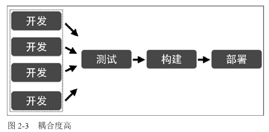
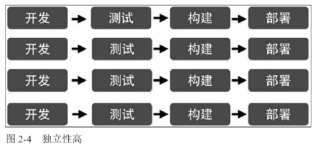
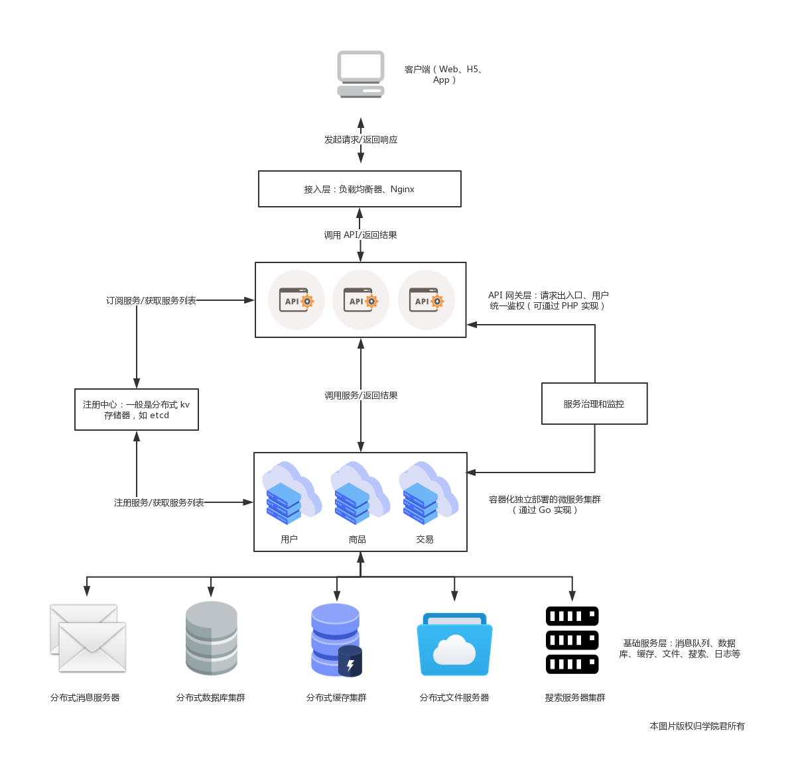
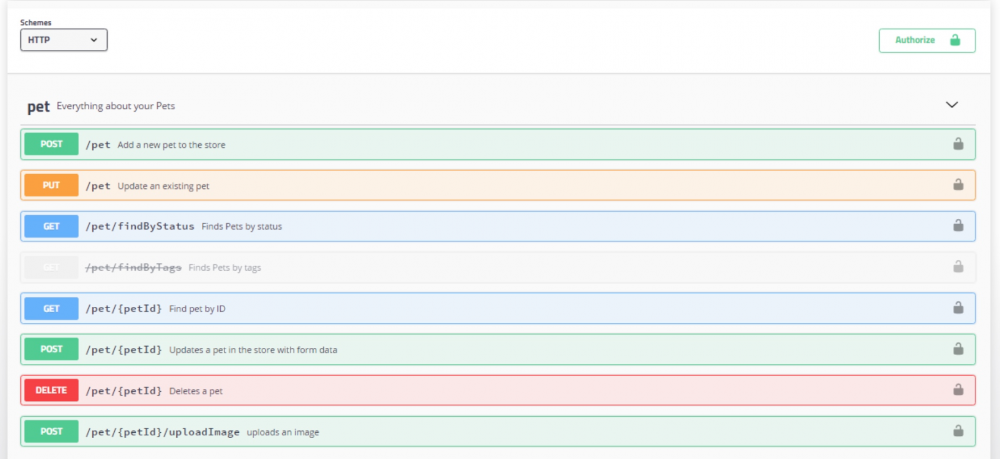
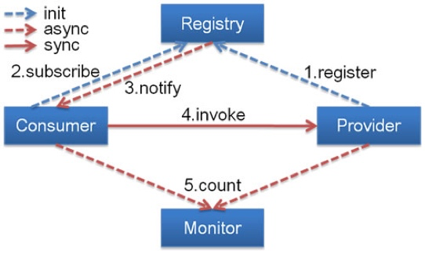
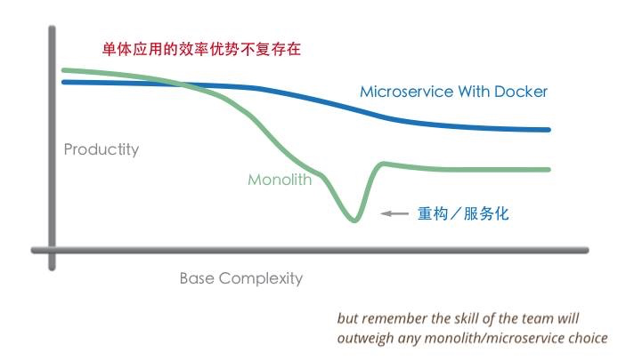

# 什么是微服务架构

在网络协议的 RPC 协议部分，我们已经简单介绍了微服务诞生的原因，以及底层 RPC 框架的运行原理，今天开始，我们正式开始微服务架构分享之旅，在此之前，我们需要明确微服务架构的概念。

### 微服务 vs 服务化

其实在微服务之前，还有服务化的概念，主要应用在 Java 项目中，把传统单机应用通过 JAR 包依赖产生的本地方法调用，改造成通过 RPC 接口产生的远程方法调用，不同的功能模块拆分成独立的服务模块单独部署，以 RPC 接口的形式对外提供服务，这些拆分后的服务模块也是单独开发、测试、部署和运维的。看起来服务化已经解决了单体应用的问题，为什么还会出现微服务呢？

微服务其实是服务化的延伸，从 2014 年开始，得益于以 Docker 为代表的容器化技术的成熟以及 DevOps 文化的兴起，服务化的思想进一步演化，演变为今天我们所熟知的微服务。

那么微服务相比于服务化又有什么不同呢？大体可以总结为以下四点：

+ 服务拆分粒度更细：微服务可以说是更细维度的服务化，小到一个子模块，只要该模块依赖的资源与其他模块都没有关系，那么就可以拆分为一个微服务；
+ 服务独立部署：每个微服务都严格遵循独立打包部署的准则，互不影响，比如一台物理机上可以部署多个 Docker 实例，每个 Docker 实例可以部署一个微服务的代码；
+ 服务独立维护：每个微服务都可以交由一个小团队甚至个人来开发、测试、发布和运维，并对整个生命周期负责；
+ 服务治理能力要求高：因为拆分为微服务之后，服务的数量变多，因此需要有统一的服务治理平台，来对各个服务进行管理。

### 微服务架构的定义

其实从业界的讨论来看，微服务本身并没有一个严格的定义。不过，ThoughtWorks 的首席科学家 Martin Flowler 的描述更加通俗易懂：

> 微服务架构是一种架构模式，它提倡将单一应用程序划分成一组小的服务，服务之间互相协调、互相配合，为用户提供最终价值。每个服务运行在其独立的进程中，服务和服务间采用轻量级的通信机制互相沟通（通常是基于 HTTP 的 RESTful API）。每个服务都围绕着具体业务进行构建，并且能够被独立地部署到生产环境、类生产环境等。另外，应尽量避免统一的、集中式的服务管理机制，对具体的一个服务而言，应根据业务上下 文，选择合适的语言、工具对其进行构建。

> —— 摘自[马丁·福勒先生的博客](http://martinfowler.com/articles/microservices.html)，微服务的概念最早即来源于此。

### 微服务架构的特征

#### 1、多微才够微

微服务架构通过对特定业务领域的分析与建模，将复杂的应用分解成小而专一、耦合度低并 且高度自治的一组服务，每个服务都是很小的应用。

微服务的「微」并不是一个真正可衡量、看得见、摸得着的微。这个「微」所表达的，是一种设计思想和指导方针，是需要团队或者组织共同努力找到一个平衡点。所以，微服务到底有多微，是个仁者见仁，智者见智的问题，最重要的是团队觉得合适。但注意，如果达成「团队觉得合适」的结论，至少还应遵循以下两个基本前提：

+ 业务独立性：首先，应保证微服务是具有业务独立性的单元，并不能只是为了微而微；
+ 团队自主性：其次，考虑到团队的沟通及协作成本，一般不建议超过10人。当团队超过10人，在沟通，协作上所耗费的成本会显著增加，这也是大部分敏捷实践里提倡的。

#### 2、单一职责

所谓高内聚，是一个模块内各个元素彼此结合的紧密程度高。低耦合，是指对于一个完整的系统，模块与模块之间，尽可能独立存在。

在面向对象的设计中，更是有放之四海而皆准的「SOLID原则」。SOLID 原则中的 S 表示的是 SRP（Single Responsibility Principle，[单一职责原则](https://laravelacademy.org/post/9719)）：即一个对象应该只有一个发生变化的原因，如果一个对象可被多个原因改变，那么就说明这个对象承担了多个职责。

对于每个服务而言，我们希望它处理的业务逻辑能够单一，在服务架构层面遵循单一职责原则。也就是说，微服务架构中的每个服务，都是具有业务逻辑的，符合高内聚、低耦合原则以及单一职责原则的单元，不同的服务通过「管道」的方式灵活组合，从而构建出庞大的系统。

#### 3、轻量级通信

服务之间应通过轻量级的通信机制，实现彼此之间的互通互联，互相协作。所谓轻量级通信机制，通常指语言无关、平台无关的交互方式。

对于轻量级通信格式而言，我们熟悉的 XML 或者 JSON ，它们的解析和使用基本与语言无关、平台无关。对于轻量级通信协议而言，通常基于HTTP，能让服务间的通信变得标准化并且无状态化。 [REST](https://laravelacademy.org/post/19638)（Representational State Transfer，表现层状态转化），是实现服务之间互相协作的轻量级通信机制之一。

对于微服务而言通过使用语言无关、平台无关的`轻量级通信机制`，使服务与服务之间的协作变得更加标准化，也就意味着在保持服务外部通信机制轻量级的情况下，团队可以选择更适合的语言、工具或者平台来开发服务本身。

#### 4、独立性

独立性是指在应用的交付过程中，开发、测试以及部署的独立。

在传统的单体架构应用中，所有功能都存在于同一个代码库中。当修改了代码库中的某个功能，很容易出现功能之间相互影响的情况。尤其是随着代码量、功能的不断增加，风险也会逐渐增加。

除此之外，当多个特性被不同小组实现完毕，需要经过集成、回归测试，团队才有足够的信心，保证功能相互配合、正常工作并且互不影响。因此，测试过程不是一个独立的过程。

当所有测试验证完毕，单体架构应用将被构建成一个部署包，并标记相应的版本。在部署过程中，单体架构部署包将被部署到生产环境，如果其中某个特性存在缺陷，则有可能导致整个部署过程的失败或回滚。、

单体应用开发、测试、构建、部署流程图如下：



在微服务架构中，每个服务都是一个独立的业务单元，当对某个服务进行改变时，对其他的服务不会产生影响。换句话说，服务和服务之间是独立的。对于每个服务，都有独立的代码库。当对当前服务的代码进行修改后，并不会影响其他服务。从代码库的层面而言，服务与服务是隔离的。

对于每个服务，都有独立的测试机制，并不担心破坏其他功能而需要建立大范围的回归测试。由于构建包是独立的，部署流程也就能够独立，因此服务能够运行在不同的进程中。

微服务开发、测试、构建、部署流程图如下：



#### 5、进程隔离

所有功能运行在同一个进程中，也就意味着，当对应用进行部署时，必须停掉当前正在运行的应用，部署完成后，再重新启动进程，无法做到独立部署。如果当前某应用中包含定时任务的功能，则要考虑在什么时间窗口适合部署，是否先停掉消息队列或者切断与数据源的联系，以防止数据被读入应用程序内存，但还未处理完，应用就被停止而导致的数据不一致性。

为了提高代码的重用以及可维护性，在应用开发中，我们有时也会将重复的代码提取出来，封装成组件（比如 PHP 中的 Composer 扩展包）。在传统的单体架构应用中，当应用程序在运行期时，所有的组件最终也会被加载到同一个进程中运行。

在微服务架构中，应用程序由多个服务组成，每个服务都是一个具有高度自治的独立业务实体。通常情况下，每个服务都能运行在一个独立的操作系统进程中，这就意味着不同的服务能非常容易的被部署到不同的主机上。作为运行微服务的环境，我们希望它能够保持高度自治性和隔离型。如果多个服务运行在同一个服务器节点上，虽然省去了节点的开销，但是增加了部署和扩展的复杂度。

总而言之，微服务架构其实是将单一的应用程序划分成一组小的服务，每个服务都是具有业务属性的独立单元，同时能够被独立开发、独立运行、独立测试以及独立部署。

# 微服务架构总体设计和基础组件

### 总体设计

看完微服务的定义后，接下来我们一起走进微服务架构，来看看它的总体设计和各个组成部分。在具体介绍之前先来看下微服务架构的整体架构图和一次正常的服务调用的完整流程：



首先`服务提供者`（用户、商品等微服务子模块）按照指定格式的服务接口描述，`向注册中心注册服务`，声明自己能够提供哪些服务以及服务的地址是什么，完成服务发布。

接下来`服务消费者`（API 网关层或者相邻的其它微服务模块）`请求注册中心`，查询所需要调用服务的地址，然后以约定的通信协议向服务提供者发起请求，得到请求结果后再按照约定的协议解析结果。

在服务调用过程中，服务的请求耗时、调用量以及成功率等指标都会被记录下来用作监控，调用经过的链路信息会被记录下来，用于故障定位和问题追踪。在这期间，如果调用失败，可以通过重试等服务治理手段来保证成功率。

所以总结起来，微服务架构下，服务调用主要依赖下面几个基本组件：

+ `注册中心`：注册并维护远程服务及服务提供者的地址，供服务消费者发现和调用，为保证可用性，通常基于分布式 kv 存储器来实现，比如 zookeeper、etcd 等；
+ `服务框架`：用于实现微服务的 RPC 框架，包含服务接口描述及实现方案、向注册中心发布服务等功能，常见的 RPC 框架包括 Spring Cloud、Dubbo、gRPC、 Thrift、go-micro 等；
+ `服务网关`：介于客户端与微服务之间的网关层，可以理解为「门卫」的角色，以确保服务提供者对客户端的透明，这一层可以进行反向路由、安全认证、灰度发布、日志监控等前置动作；
+ `服务监控`：对服务消费者与提供者之间的调用情况进行监控和数据展示；
+ `服务追踪`：记录对每个请求的微服务调用完整链路，以便进行问题定位和故障分析；
+ `服务治理`：服务治理就是通过一系列的手段来保证在各种意外情况下，服务调用仍然能够正常进行，这些手段包括熔断、隔离、限流、降级、负载均衡等。
+ 基础设施：分布式消息队列、日志存储、数据库、缓存、文件服务器、搜索集群等，用以提供服务底层的基础数据服务，可以自建，也可以使用阿里云等公有云提供的服务。

此外，从微服务部署角度来说，我们通常会基于容器编排技术实现微服务的运维。

### 各个组件

接下来，我们会逐一介绍这些组件在微服务中的实现，这些组件基本上都有成熟的开源框架可供选择。

#### 服务描述

服务调用首先要解决的问题就是如何对外描述服务。比如服务的名称、请求参数和返回信息，以及服务返回信息如何解析，在本地方法调用中这根本不是什么问题，但是在微服务中，服务提供者与消费者之间可能是通过不同语言开发的，而且是通过远程网络请求来调用服务，所以这些东西必须要事先约定好。

常用的服务描述方式包括 RESTful API、XML 配置以及 IDL 文件三种。

其中，RESTful API 方式通常用于 HTTP 协议的服务描述，接口文档可以通过[Swagger](http://swagger.io/) 进行管理和维护，Spring Cloud 框架默认就是通过 REST API 提供服务。下面是一个 RESTful API 方式的服务描述的例子（官方文档的示例，在 Laravel 学院也有[介绍教程](https://laravelacademy.org/post/19694)）：



基于 HTTP 协议的 REST 服务接口虽然简单，但是性能不如基于 TCP 的 RPC 协议，RPC 协议的服务描述通常通过 XML 配置文件来定义接口名、参数以及返回值类型等，比如 Dubbo 框架默认就是以私有化的 RPC 协议（`dubbo`）来提供服务接口描述，对应的 XML 配置示例如下：

```xml
<beans xmlns:xsi="http://www.w3.org/2001/XMLSchema-instance"
       xmlns:dubbo="http://dubbo.apache.org/schema/dubbo"
       xmlns="http://www.springframework.org/schema/beans"
       xsi:schemaLocation="http://www.springframework.org/schema/beans http://www.springframework.org/schema/beans/spring-beans-4.3.xsd
       http://dubbo.apache.org/schema/dubbo http://dubbo.apache.org/schema/dubbo/dubbo.xsd">

    <!-- provider's application name, used for tracing dependency relationship -->
    <dubbo:application name="demo-provider"/>
    <!-- use multicast registry center to export service -->
    <dubbo:registry address="multicast://224.5.6.7:1234"/>
    <!-- use dubbo protocol to export service on port 20880 -->
    <dubbo:protocol name="dubbo" port="20880"/>
    <!-- service implementation, as same as regular local bean -->
    <bean id="demoService" class="org.apache.dubbo.demo.provider.DemoServiceImpl"/>
    <!-- declare the service interface to be exported -->
    <dubbo:service interface="org.apache.dubbo.demo.DemoService" ref="demoService"/>
</beans>
```


#### 注册中心

有了服务的接口描述，下一步要解决的问题就是服务的发布和订阅，当你通过服务提供者提供了一个新的服务，如何让服务消费者感知呢？这个时候就需要一个类似注册中心的角色，服务提供者将自己提供的服务以及 IP 地址登记到注册中心，服务消费者则从注册中心查询所需要调用服务的地址信息，然后发起网络请求。

通常，注册中心的工作流程是这样的：

+ 服务提供者在启动时，根据服务发布文件中配置的发布信息向注册中心注册自己的服务。
+ 服务消费者在启动时，根据消费者配置文件中配置的服务信息向注册中心订阅自己所需要的服务。
+ 注册中心返回服务提供者地址列表给服务消费者。
+ 当服务提供者发生变化，比如有节点新增或者销毁，注册中心将变更通知给服务消费者。

下面是服务化框架 Dubbo 的工作流程图，和我们上面介绍的流程是一样的：



#### 服务框架

通过注册中心，服务消费者就可以获取到服务提供者的地址，有了地址后就可以发起调用。但在发起调用之前你还需要解决以下几个问题：

+ 服务通信采用什么协议？就是说服务提供者和服务消费者之间以什么样的协议进行网络通信，是采用四层 TCP、UDP 协议，还是采用七层 HTTP 协议，还是采用其他协议？
+ 数据传输采用什么方式？就是说服务提供者和服务消费者之间的数据传输采用哪种方式，是同步还是异步，是在单连接上传输，还是多路复用。
+ 数据压缩采用什么格式？通常数据传输都会对数据进行压缩，来减少网络传输的数据量，从而减少带宽消耗和网络传输时间，比如常见的 JSON 序列化、Java 对象序列化以及 Protobuf 序列化等。

#### 服务监控

一旦服务消费者与服务提供者之间能够正常发起服务调用，你就需要对调用情况进行监控，以了解服务是否正常。通常来讲，服务监控主要包括三个流程。

+ 指标收集。就是要把每一次服务调用的请求耗时以及成功与否收集起来，并上传到集中的数据处理中心。
+ 数据处理。有了每次调用的请求耗时以及成功与否等信息，就可以计算每秒服务请求量、平均耗时以及成功率等指标。
+ 数据展示。数据收集起来，经过处理之后，还需要以友好的方式对外展示，才能发挥价值。通常都是将数据展示在 Dashboard 面板上，并且每隔 10s 等间隔自动刷新，用作业务监控和报警等。

#### 服务追踪

除了需要对服务调用情况进行监控之外，你还需要记录服务调用经过的每一层链路，以便进行问题追踪和故障定位。

服务追踪的工作原理大致如下：

+ 服务消费者发起调用前，会在本地按照一定的规则生成一个 requestid，发起调用时，将 requestid 当作请求参数的一部分，传递给服务提供者。
+ 服务提供者接收到请求后，记录下这次请求的 requestid，然后处理请求。如果服务提供者继续请求其他服务，会在本地再生成一个自己的 requestid，然后把这两个 requestid 都当作请求参数继续往下传递。
+ 以此类推，通过这种层层往下传递的方式，一次请求，无论最后依赖多少次服务调用、经过多少服务节点，都可以通过最开始生成的 requestid 串联所有节点，从而达到服务追踪的目的。

#### 服务治理

服务监控能够发现问题，服务追踪能够定位问题所在，而解决问题就得靠服务治理了。服务治理就是通过一系列的手段来保证在各种意外情况下，服务调用仍然能够正常进行。

在生产环境中，你应该经常会遇到下面几种状况。

+ 单机故障。通常遇到单机故障，都是靠运维发现并重启服务或者从线上摘除故障节点。然而集群的规模越大，越是容易遇到单机故障，在机器规模超过一百台以上时，靠传统的人肉运维显然难以应对。而服务治理可以通过一定的策略，自动摘除故障节点，不需要人为干预，就能保证单机故障不会影响业务。
+ 单 IDC 故障。你应该经常听说某某 App，因为施工挖断光缆导致大批量用户无法使用的严重故障。而服务治理可以通过自动切换故障 IDC 的流量到其他正常 IDC，可以避免因为单 IDC 故障引起的大批量业务受影响。
+ 依赖服务不可用。比如你的服务依赖依赖了另一个服务，当另一个服务出现问题时，会拖慢甚至拖垮你的服务。而服务治理可以通过熔断，在依赖服务异常的情况下，一段时期内停止发起调用而直接返回。这样一方面保证了服务消费者能够不被拖垮，另一方面也给服务提供者减少压力，使其能够尽快恢复。

上面是三种最常见的需要引入服务治理的场景，当然还有一些其他服务治理的手段比如自动扩缩容，可以用来解决服务的容量问题。

# 微服务的优缺点和适用场景

上篇分享我们介绍了微服务的整体架构和组件，可以看到微服务架构要比单体应用的架构复杂很多，所以这篇分享学院君将在正式介绍微服务架构的具体组件和落地实践之前，给大家分析下微服务的利弊和适用场景，否则，没有权衡清楚贸然进行微服务重构的话，可能会引入很多意料之外的问题。

### 微服务的优缺点

关于微服务架构的优缺点我们在网络协议：RPC 部分已经简单介绍过，这里我们通过表格的形式更加直观的来对比：

| S/N  | 对比点                   | 微服务架构                                                   | 单体架构                                                     | 结论                                             |
| ---- | ------------------------ | ------------------------------------------------------------ | ------------------------------------------------------------ | ------------------------------------------------ |
| 1    | 上手难度                 | API 接口调用                                                 | 数据库共享或本地程序调用                                     | 单体架构胜                                       |
| 2    | 开发效率                 | 早期设计和沟通的工作量加大，随着项目规模和时间的推移，效率变化不大 | 早期工作量小，随着项目规模和时间的推移，效率大幅度下降       | 对于简单项目单体架构胜，对于复杂项目微服务架构胜 |
| 3    | 系统设计（高内聚低耦合） | 每个业务单独包装成一个微服务，数据和代码都从物理上隔离开来，实现高内聚低耦合相对容易 | 以包的形式对代码进行模块划分，控制得当即可实现高内聚。但最终都是在数据层面将整个系统耦合在一起 | 微服务架构胜                                     |
| 4    | 系统设计（扩展性）       | 独立开发新模块，通过 API 与现有模块交互                      | 在现有系统上修改，与现存业务逻辑高度耦合                     | 微服务架构胜                                     |
| 5    | 需求变更响应速度         | 各个微服务组件独立变更，容易实施敏捷开发方法                 | 需要了解整个系统才可以正确修改，容易导致不相关模块的意外失败 | 微服务架构胜                                     |
| 6    | 系统升级效率             | 各个微服务组件独立升级，上手和开发效率高，影响面小           | 需要了解整个系统才可以正确修改，容易导致不相关模块的意外失败 | 微服务架构胜                                     |
| 7    | 运维效率                 | 大系统被拆分为多个小系统，部署和运维难度加大，但可以利用 DevOps 等方式将运维工作自动化 | 简单直接                                                     | 单体架构胜                                       |
| 8    | 代码复用性               | 微服务组件可以在新项目中直接复用，包括前端页面               | 一般以共享库的形式复用后台代码                               | 微服务架构胜                                     |
| 9    | 硬件需求                 | 按需为不同业务模块伸缩资源节点，一个系统需部署多个微服务，需要启动多个运行容器 | 整个系统只需要一个运行容器，为整个系统分配资源               | 对于简单项目单体架构胜，对于复杂项目微服务架构胜 |
| 10   | 项目成本                 | 项目早期和后期，成本变化曲线平缓                             | 项目早期成本低，后期成本大                                   | 对于简单系统单体架构胜，对于复杂系统微服务架构胜 |
| 11   | 非功能需求               | 为单独的微服务按需调优，甚至更换实现方式和程序语言           | 为整个系统调优，牵一发而动全身                               | 微服务架构胜                                     |
| 12   | 职责、成就感             | 拥有明确的职责划分，主人翁意识和成就感加强，容易形成自组织型团队 | 职责不明确，容易产生扯皮行为                                 | 微服务架构胜                                     |
| 13   | 风险                     | 大系统被拆分为小系统，风险可被控制在小系统内，但也引入了各小系统之间的交互风险 | 系统是一个整体，一荣俱荣，一损俱损                           | 微服务架构胜                                     |

对于简单项目来说，单体架构 5 胜 8 败，优势主要体现在开发效率、上手难度、运维效率、硬件需求、项目成本；对于复杂项目来说，微服务架构 11 胜 2败，优势主要体现在硬件需求、项目成本、开发效率、系统设计时的高内聚低耦合和可扩展性、需求变更响应速度、系统升级效率、代码复用性、非功能需求、职责/成就感、风险的可控性。

所以对于小型简单系统来说，使用单体架构更合适，对于大型复杂系统来说，使用微服务架构更合适，但是尽管如此，微服务也不是银弹，它也为系统引入了新的问题比如提高了系统的复杂度，这也导致了开发人员上手难度增加，需要在理解分布式系统设计的基础上才能更好的开发和维护微服务，再就是分布式服务的调用问题，服务的注册和发现、服务之间的分布式事务问题，数据库拆分之后数据报表的处理，数据库查询的复杂度增加，服务之间分布式一致性的问题，此外也为系统运维和管理增加了复杂度，这都是我们在进行微服务架构时要做好的心里准备和技术储备。

### 微服务的适用场景

所以微服务也不是一招鲜吃遍天，不是能够解决所有问题的万金油，它有其特定的适用场景，用之不慎很有可能带来负面作用，陷入上述提到的微服务泥淖之中无法自拔，一定要在系统进行微服务重构时认识到这一点。那么哪些场景适合使用微服务架构呢？满足以下三个条件即可考虑：

+ 团队规模较大，超过10人；
+ 业务复杂度高，超过5个以上的子模块（业务功能较复杂）；
+ 项目需要长期迭代开发和维护（半年以上）。

以下是一个单体应用与微服务开发效率的曲线，随着业务复杂度的增加，单体应用的效率逐渐降低，甚至在某个临界点出现断崖式下跌，之后，微服务的优势就很明显了，所以很多公司在单体应用的效率低到无法接收时都会开始服务化/微服务重构：



如果一开始面临的就是一个复杂的满足上述三个条件的系统开发，我们也可以在一开始就引入微服务架构，以避免后续重构引入的额外风险和时间成本。

经过这一篇介绍，相比你应该对什么时候使用微服务架构有了一个很量化的认识，下一篇开始，我们就来介绍构成微服务架构的各个组件是如何协同工作以实现分布式服务调用的。

# 服务拆分与技术保障

[上篇分享](https://xueyuanjun.com/post/20966)学院君给大家介绍了微服务与单体应用的对比和优势，以及什么情况下适合使用微服务架构，对于大公司而言，可能之前已经进行过微服务重构，相应的底层服务都已经拆分，所以后续新功能开发会在微服务体系中进行迭代，而对于中小型公司，大部分情况是项目早期采用单体架构以便快速迭代和部署，当业务规模、团队规模成长到一定阶段，不得不需要通过微服务架构对服务进行拆分（这个服务拆分的时间节点就是我们上篇分享介绍的需要满足的三个条件是否成熟），对系统进行重构，即下面绿色曲线所代表的情况：


### 服务拆分的维度

如果已经决定要对系统进行微服务重构改造，首先要对耦合在单体应用中的服务进行拆分，那么服务拆分具体该怎么做呢？或者换句话说，服务拆分按照什么标准，以哪些维度作为划分依据？

这里主要有两种方式：

+ 一种是从业务功能的角度进行纵向的垂直拆分，以电商网站为例，可以把常态购买看作一个服务模块，把特卖看看作一个服务模块，把拼团看作一个服务模块，把海外购看作一个服务模块，然后根据与相应模块关联的密切程度将对应的业务逻辑划分到具体的微服务中；
+ 一种是从公用且功能独立的角度进行横向的水平拆分，还是以电商网站为例，上述所有服务模块都会用到用户、商品、交易这些公共功能，我们可以把这些模块也拆分为独立的微服务。

与服务拆分相关联的，还有公司组织架构的调整，原来大家可能都混在一起做开发，现在要根据拆分出来的服务为每个模块配对对应的开发人员，以便实现后续的独立开发、测试、部署和维护，另外可能还要涉及到数据库的拆分、缓存部署的调整。

### 服务拆分前的技术保障

前面我们多次强调过，伴随着服务的拆分和分布式的部署调用，使得系统架构的复杂性大大增加，为系统引入了很多新的问题，比如运维、配置、问题追踪与系统监控、远程服务发布与调用等，我们必须要做好这些配套的技术保障，才能开始操刀进行微服务重构。这些问题，也是从单体应用迁移到微服务架构时必将面临也必须解决的：

+ 服务接口定义：对于单体应用来说，不同功能模块之间交互时，通常是以类库的方式来提供各个模块的功能；对于微服务来说，每个服务都运行在各自的进程之中，通过远程接口才能提供相应的服务，无论采用 HTTP 还是 RPC 协议，服务之间的调用都通过接口描述来约定，约定内容包括接口名、接口参数以及接口返回值。
+ 服务发布与调用：单体应用由于部署在同一个包里，接口之间的调用属于进程内的调用；而拆分为微服务独立部署后，服务提供者该如何对外暴露自己的地址，服务调用者该如何查询所需要调用的服务的地址呢？这个时候你就需要一个注册中心，能够记录每个服务提供者的地址以供服务调用者查询。
+ 服务监控方案：在微服务中需要一种通用的监控方案，能够覆盖业务埋点、数据收集、数据处理，最后到数据展示的全链路功能。
+ 服务治理方案：拆分为微服务架构后，服务的数量变多了，依赖关系也变复杂了，当一个服务的性能有问题时，依赖的服务势必会受到影响，要如何通过熔断、限流、降级、负载均衡等方式将影响降到最低。
+ 故障定位方案：在单体应用拆分为微服务之后，一次用户调用可能依赖多个服务，每个服务又部署在不同的节点上，如果用户调用出现问题，需要有一种解决方案能够将一次用户请求进行标记，并在多个依赖的服务系统中继续传递，以便串联所有路径，从而进行故障定位。

从下一篇开始，我们就将结合一个具体的微服务 RPC 框架来介绍上述问题是如何得到解决的。另外，微服务架构中，还可能要面临的一些问题是分库之后分布式数据库的访问和事务一致性，分布式缓存的设计和访问，以及公共配置中心的访问和设置，还有微服务拆分后部署和运维的复杂性增加，该如何解决等，这些都是我们在做微服务拆分的时候需要考虑到的，后续在高阶部分，学院君将给大家介绍这些问题的解决方案。