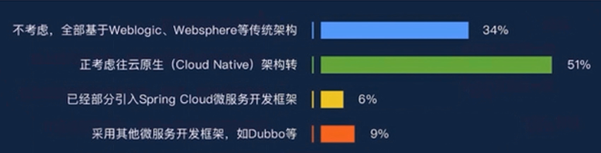
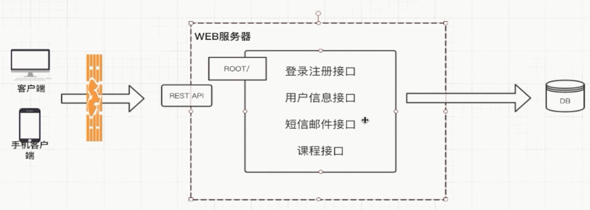
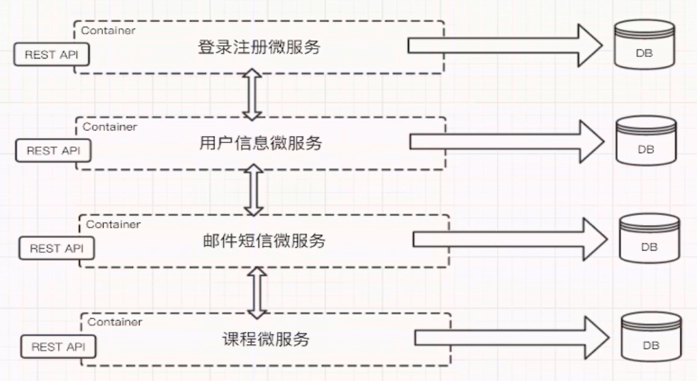

##  微服务大环境

### 微服务的意义

  例如我们在一个基础的商场系统当中，可能分为用户模块，商品模块，订单模块、活动模块等，系统建设初期， 我们也许为了快速上线和节约成本，那么就是直接一整套的模块代码，全部写在一个项目代码中。 而在后期流量上来后，我们会发现，经常因为某个模块的的模块失效，导致整个服务瘫痪。例如活动模块，和商品模块是最容易在高流量下瘫痪的。举个例子，在2018年的双十一活动中， 某商场系统花了很多钱去做广告，导致很高流量直接进入到商场系统当中，而在此之前，也没做服务拆分，那么活动模块的高流量导致数据库和带宽完全无法支撑，整个商场全部进入黑洞状态，，用户即无法进入活动页面，连正常的商场首页也无法打开。 后面，在Easyswoole项目组的建议下，将商场系统进行了模块化服务拆分，例如，活动系统就是一个独立的服务，用户参与活动的时候，直接从客户端调用活动服务接口，活动服务需要验证商品和用户数据的时候，又通过RPC调用进行服务间的数据交互。从而实现 压力的分摊，不再让全部的服务压力都堆积到单台服务器或数据库上，且在最糟糕的情况下，即使活动模块瘫痪，也不会导致整个商场系统不可用。 　

  因此微服务的主要意义在于，流量分压，模块高度自治，服务隔离保护。

### 什么是微服务框架

  实际上，所谓的微服务框架，是一种错误的说法，微服务是一种架构性上的概念，与框架无关。例如，在以上的案例当中，我们服务间的互相调用，可以用HTTP,或者是原生TCP协议来实现，因此实际上，和框架没有半毛钱关系。而如果真的要牵强的说是微服务框架的话，那其实是无非类似某些框架做了一些组件的封装，让你更加方便的实现RPC调用。例如Easyswoole就提供了RCP封装和基础的服务发现与注册中心。但是实际上，这仅仅是工具，真正的微服务，最核心的其实是如何做好服务间的最小粒度切分，也就是其实这个属于架构规划上的范畴。

### 服务限流

再举一个我们生活中的例子：一些热门的旅游景点，往往会对每日的旅游参观人数有严格的限制，比如厦门的鼓浪屿、北京的故宫等，每天只会卖出固定数目的门票，如果你去的晚了，可能当天的票就已经卖完了，当天就无法进去游玩了。 为什么旅游景点要做这样的限制呢？多卖一些门票多赚一些钱岂不是更好？

其实对于旅游景点而言，她们也很无奈，因为景点的服务资源有限嘛，每日能服务的人数是有限的，一旦放开限制了，景点的工作人员就会不够用，卫生情况也得不到保障，安全也有隐患，超密集的人群也会严重的影响游客的体验。 但由于景区名气大，来游玩的旅客络绎不绝，远超出了景区的承载能力，因此景区只好做出限制每日人员流量的举措。

同理，在IT软件行业中，系统服务也是这样的。如果你的系统理论是时间单位内可服务100W用户，但是今天却突然来了300W用户，由于用户流量的随机性，如果不加以限流，很有可能这300W用户一下子就压垮了系统，导致所有人都得不到服务。 因此为了保证系统至少还能为100W用户提供正常服务，我们需要对系统进行限流设计。

有的人可能会想，既然会有300W用户来访问，那为啥系统不干脆设计成能足以支撑这么大量用户的集群呢？ 这是个好问题。如果系统是长期有300W的用户来访问，肯定是要做上述升级的，但是常常面临的情况是，系统的日常访问量就是100W，只不过偶尔有一些不可预知的特定原因导致的短时间的流量激增，这个时候，公司往往出于节约成本的考虑，不会为了一个不常见的尖峰来把我们的系统扩容到最大的尺寸。

### 如何限流

在实际的应用当中，流量入口应该是：

```
防火墙 --> Api网关 --> 服务
```

因此，实际上我们是有三个地方可以进行限流。那么，防火墙，和API网关我们则不再进行讲解，那是运维的事情。我们要说的是API网关的自我保护。在Easyswoole中，有提供了一个基础的AtomicLimit组件，原理与令牌桶差不多，有兴趣的同学可以去看下。当然Easyswoole也支持其他方式的限流，你可以在流量入口的onRequest方法中进行拦截。

### 熔断保护

这个模式是需要系统在设计之初，就要把熔断措施考虑进去。当系统出现问题时，如果短时间内无法修复，系统要自动做出判断，开启熔断开关，拒绝流量访问，避免大流量对后端的过载请求。系统也应该能够动态监测后端程序的修复情况，当程序已恢复稳定时，可以关闭熔断开关，恢复正常服务。

### 服务降级

将系统的所有功能服务进行一个分级，当系统出现问题，需要紧急限流时，可将不是那么重要的功能进行降级处理，停止服务，这样可以释放出更多的资源供给核心功能的去用。

例如在电商平台中，如果突发流量激增，可临时将商品评论、积分等非核心功能进行降级，停止这些服务，释放出机器和CPU等资源来保障用户正常下单，而这些降级的功能服务可以等整个系统恢复正常后，再来启动，进行补单/补偿处理。 除了功能降级以外，还可以采用不直接操作数据库，而全部读缓存、写缓存的方式作为临时降级方案。

### 延迟处理

这个模式需要在系统的前端设置一个流量缓冲池，将所有的请求全部缓冲进这个池子，不立即处理。然后后端真正的业务处理程序从这个池子中取出请求依次处理，常见的可以用队列模式来实现。这就相当于用异步的方式去减少了后端的处理压力，但是当流量较大时，后端的处理能力有限，缓冲池里的请求可能处理不及时，会有一定程度延迟。

### 特权处理

这个模式需要将用户进行分类，通过预设的分类，让系统优先处理需要高保障的用户群体，其它用户群的请求就会延迟处理或者直接不处理。

## 微服务发展

微服务运行在docker中，使用k8s来管理容器

### 要解决的问题

- 互联网IT系统更新频率比较高
- IT系统支撑所存在的问题
  - 系统复杂性越来越高
  - 线上访问压力大，交付速度无法满足业务需求
  - 设备采购和维护成本过高，测试、部署等成本高
  - IT运维管理复杂，构建一支全功能团队困难
  - 厂商服务水平和及时性无法满足需求

### 微服务架构落地情况



## 初识微服务

### 软件架构的进化

软件架构是在软件的内部，经过`综合各种因素`的考量、权衡，

`选择特定的技术`，将系统`划分成不同的部分`并使这些部分相互分工，

彼此协作，为用户提供需要的价值。


### 什么是微服务

#### 因素?

- 业务需求
- 成本
- 可扩展性
- 技术栈
- 组织架构
- 可维护性

### 什么是单体架构

#### 定义:

功能、业务集中在一个`发布包`里，部署运行在同一个进程中。

#### 单体架构的优势

易于开发
易于部署
易于测试
易于水平伸缩

#### 单体架构面临的挑战

- 代码膨胀，难以维护
- 构建、部署成本大
- 新人上手困难


## 微服务概念

使用一套**小服务**来开发单个应用的方式，每个服务运行在`独立的进程`里，一般采用`轻量级的通讯机制`互联，并且它们可以通过`自动化`的方式部署。

### 特征

- 单一职责

- 轻量级通信

- 隔离性

- 有自己的数据

- 技术的多样性 不局限于语言

### 微服务诞生背景

- 互联网行业的快速发展
- 敏捷开发，精益方法深入人心【快速开发、测试、上线、获取反馈、迭代】
- 容器技术的成熟


## 架构图

### 假定业务场景

- 个在线教育的网站的部分功能
- 用户可以登录注册，获取用户信息
- 有发送邮件发送短信的功能
- 可以查看课程列表和对课程的基本CRUD



### 拆分为微服务



### 使用apiGateWay


## 优势和不足

### 微服务架构的优势

- 独立性
- 技术栈灵活
- 敏捷性
- 高效团队

### 微服务架构的不足

- 额外的工作【微服务拆分】
- 数据一致性【分布式】
- 沟通成本 【接口改变】